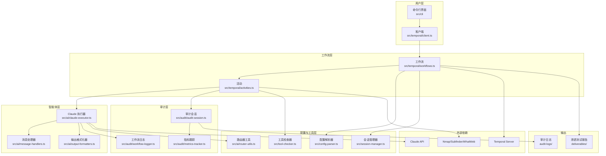
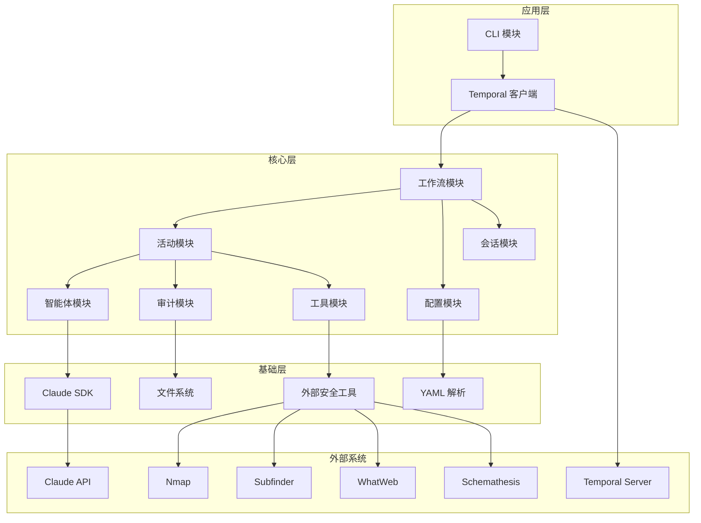
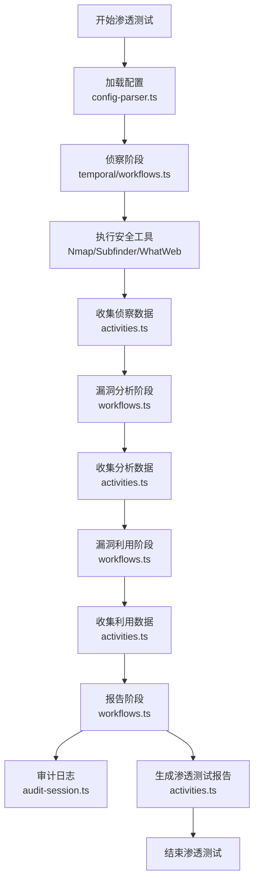
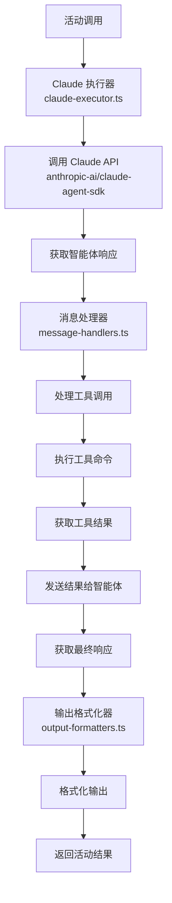
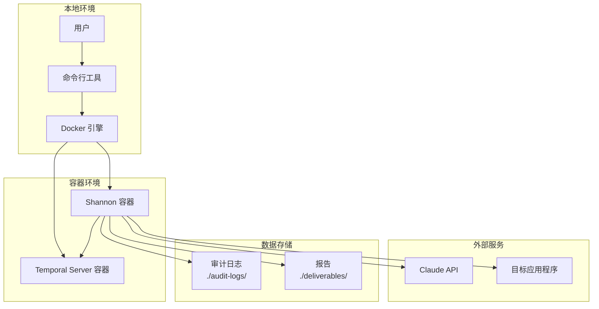

# Shannon 项目工程文档

## 1. 项目架构概述

### 1.1 架构设计理念

Shannon 是一款 AI 渗透测试工具，采用多智能体架构模拟人类渗透测试人员的方法。它结合了白盒源代码分析和黑盒动态漏洞利用，通过四个不同的阶段进行系统性的安全测试。

### 1.2 架构模式选择依据

1. **多智能体架构**：
   - **选择原因**：模拟人类渗透测试人员的工作流程，分阶段执行任务，提高测试效率和准确性
   - **优势**：并行处理能力强，职责分明，可扩展性好
   - **劣势**：复杂性较高，需要协调多个智能体的工作

2. **工作流管理**：
   - **选择原因**：渗透测试是一个长时间运行的过程，需要可靠的状态管理和错误处理
   - **优势**：提供工作流编排、错误处理、重试机制和状态管理
   - **劣势**：增加了系统复杂性

3. **容器化部署**：
   - **选择原因**：确保环境一致性，简化部署过程，提高安全性
   - **优势**：环境隔离，依赖管理简单，部署便捷
   - **劣势**：增加了一定的资源开销

### 1.3 核心组件关系图



### 1.4 关键技术决策说明

1. **选择 Temporal.io 作为工作流管理系统**：
   - **决策理由**：提供可靠的工作流编排，支持长时间运行的任务，具有错误处理和重试机制
   - **影响**：提高了系统的可靠性和可维护性，但增加了一定的复杂性

2. **选择 Anthropic Claude 作为 AI 模型**：
   - **决策理由**：Claude 在代码理解和安全分析方面表现出色，提供了专门的 Agent SDK
   - **影响**：提高了渗透测试的准确性和深度，但依赖外部 API

3. **采用容器化部署**：
   - **决策理由**：确保环境一致性，简化部署过程，提高安全性
   - **影响**：简化了部署和依赖管理，但增加了一定的资源开销

4. **使用多阶段构建**：
   - **决策理由**：减少最终镜像大小，提高安全性
   - **影响**：构建过程更复杂，但最终镜像更小、更安全

### 1.5 架构演进规划

1. **近期规划**：
   - 扩展支持更多漏洞类型
   - 增强与 CI/CD 系统的集成
   - 改进报告生成功能

2. **中期规划**：
   - 实现更高级的数据流分析
   - 支持更多 AI 模型和提供商
   - 增强自动化修复建议

3. **长期规划**：
   - 构建完整的安全与合规平台
   - 支持更多安全测试场景
   - 提供更高级的安全分析能力

## 2. 技术栈说明

### 2.1 前端技术

本项目为后端工具，无前端技术栈。

### 2.2 后端技术

| 技术 | 版本 | 用途 | 选型理由 |
|------|------|------|----------|
| TypeScript | 5.9.3 | 主要开发语言 | 类型安全，提高代码质量和可维护性 |
| Node.js | 22.x | 运行环境 | 跨平台，生态丰富，适合构建 CLI 工具 |
| Temporal.io | 1.11.0 | 工作流管理系统 | 可靠的工作流编排，支持长时间运行的任务 |
| Docker | - | 容器化运行 | 环境隔离，依赖管理简单，部署便捷 |

### 2.3 数据库

本项目不使用传统数据库，数据存储在文件系统中：
- 审计日志：存储在 `./audit-logs/` 目录
- 会话数据：存储在 `session.json` 文件
- 报告：存储在 `deliverables/` 目录

### 2.4 中间件

| 中间件 | 版本 | 用途 | 选型理由 |
|--------|------|------|----------|
| Temporal Server | 1.11.0 | 工作流执行引擎 | 提供工作流编排、错误处理和状态管理 |
| MCP Server | - | Claude 模型上下文协议服务器 | 提供浏览器自动化能力，支持复杂的交互场景 |

### 2.5 开发工具

| 工具 | 版本 | 用途 | 选型理由 |
|------|------|------|----------|
| TypeScript Compiler | 5.9.3 | 代码编译 | 将 TypeScript 编译为 JavaScript |
| npm | - | 包管理 | 管理项目依赖 |
| Git | - | 版本控制 | 代码版本管理 |
| Docker | - | 容器运行时 | 构建和运行容器 |
| Nmap | - | 网络扫描 | 识别网络服务和漏洞 |
| Subfinder | 最新版 | 子域名发现 | 发现目标的子域名 |
| WhatWeb | 最新版 | 网站指纹识别 | 识别网站使用的技术栈 |
| Schemathesis | 最新版 | API 测试 | 自动测试 API 端点 |

### 2.6 兼容性要求

| 组件 | 兼容性要求 | 备注 |
|------|------------|------|
| Docker | 20.10.0+ | 容器运行时 |
| Node.js | 22.x | 运行环境 |
| TypeScript | 5.9.3 | 开发环境 |
| Anthropic API | Claude 4+ | AI 模型 |
| Temporal Server | 1.11.0 | 工作流管理 |

## 3. 模块划分

### 3.1 模块划分原则

基于领域驱动设计原则，Shannon 项目按照功能职责和业务领域进行模块划分，确保各模块职责单一、边界清晰，便于维护和扩展。

### 3.2 核心模块说明

#### 3.2.1 CLI 模块

**职责边界**：
- 解析用户命令和参数
- 提供命令行交互界面
- 启动工作流和查询状态

**核心功能**：
- 命令解析和执行
- 参数验证
- 用户界面展示

**依赖关系**：
- 依赖 Temporal 客户端模块

#### 3.2.2 工作流模块

**职责边界**：
- 定义渗透测试工作流
- 协调各阶段执行
- 管理工作流状态

**核心功能**：
- 工作流定义和编排
- 活动执行和监控
- 错误处理和重试

**依赖关系**：
- 依赖活动模块
- 依赖配置解析器
- 依赖会话管理器

#### 3.2.3 智能体模块

**职责边界**：
- 与 AI 模型交互
- 处理智能体消息
- 格式化输出结果

**核心功能**：
- Claude API 调用
- 消息处理和路由
- 输出格式化

**依赖关系**：
- 依赖审计模块
- 依赖 Claude SDK

#### 3.2.4 审计模块

**职责边界**：
- 记录执行过程和结果
- 跟踪指标和成本
- 生成审计日志

**核心功能**：
- 会话审计
- 工作流日志
- 指标跟踪

**依赖关系**：
- 无直接依赖

#### 3.2.5 配置模块

**职责边界**：
- 解析和验证配置
- 加载环境变量
- 管理配置状态

**核心功能**：
- 配置文件解析
- 环境变量加载
- 配置验证

**依赖关系**：
- 依赖验证库

#### 3.2.6 工具模块

**职责边界**：
- 检查外部工具可用性
- 执行安全工具命令
- 处理工具输出

**核心功能**：
- 工具可用性检查
- 工具执行
- 输出处理

**依赖关系**：
- 依赖外部工具

### 3.3 模块层次结构图



### 3.4 模块依赖关系表

| 模块 | 依赖模块 | 依赖类型 |
|------|----------|----------|
| CLI | Temporal 客户端 | 直接依赖 |
| Temporal 客户端 | 工作流 | 直接依赖 |
| 工作流 | 活动 | 直接依赖 |
| 活动 | 智能体 | 直接依赖 |
| 活动 | 审计 | 直接依赖 |
| 活动 | 工具 | 直接依赖 |
| 智能体 | 审计 | 直接依赖 |
| 工作流 | 配置 | 直接依赖 |
| 工作流 | 会话 | 直接依赖 |
| 智能体 | Claude SDK | 外部依赖 |
| 工具 | 外部安全工具 | 外部依赖 |

## 4. 接口定义

### 4.1 内部接口

#### 4.1.1 CLI 接口

| 命令 | 参数 | 描述 | 返回值 |
|------|------|------|--------|
| `start` | URL=目标URL REPO=代码仓库 [CONFIG=配置文件] | 启动渗透测试 | 工作流 ID |
| `logs` | - | 查看实时工作日志 | 日志输出 |
| `query` | ID=工作流ID | 查询工作流进度 | 工作流状态 |
| `stop` | [CLEAN=true] | 停止所有容器 | 操作结果 |

#### 4.1.2 工作流接口

| 接口 | 参数 | 描述 | 返回值 |
|------|------|------|--------|
| `runPentestWorkflow` | `{ url, repo, config }` | 运行完整的渗透测试工作流 | 工作流结果 |
| `runReconnaissance` | `{ url, repo }` | 执行侦察阶段 | 侦察结果 |
| `runVulnerabilityAnalysis` | `{ reconData, vulnerabilityType }` | 执行漏洞分析 | 分析结果 |
| `runExploitation` | `{ analysisData, vulnerabilityType }` | 执行漏洞利用 | 利用结果 |
| `generateReport` | `{ allResults }` | 生成渗透测试报告 | 报告路径 |

#### 4.1.3 智能体接口

| 接口 | 参数 | 描述 | 返回值 |
|------|------|------|--------|
| `executeAgent` | `{ prompt, context, tools }` | 执行智能体任务 | 智能体响应 |
| `handleMessage` | `{ message, context }` | 处理智能体消息 | 处理结果 |
| `formatOutput` | `{ output, format }` | 格式化输出结果 | 格式化结果 |

#### 4.1.4 审计接口

| 接口 | 参数 | 描述 | 返回值 |
|------|------|------|--------|
| `createAuditSession` | `{ sessionId, targetUrl }` | 创建审计会话 | 会话对象 |
| `logWorkflowEvent` | `{ sessionId, event, data }` | 记录工作流事件 | 操作结果 |
| `trackMetrics` | `{ sessionId, metrics }` | 跟踪指标 | 操作结果 |
| `generateAuditReport` | `{ sessionId }` | 生成审计报告 | 报告路径 |

### 4.2 外部接口

#### 4.2.1 Claude API 接口

| 接口 | 参数 | 描述 | 返回值 |
|------|------|------|--------|
| `messages.create` | `{ model, messages, tools, tool_choice }` | 创建消息并获取智能体响应 | 智能体响应 |
| `messages.stream` | `{ model, messages, tools, tool_choice }` | 流式获取智能体响应 | 流式响应 |

#### 4.2.2 安全工具接口

| 工具 | 命令 | 参数 | 描述 | 返回值 |
|------|------|------|------|--------|
| Nmap | `nmap` | `-sV -p-` | 网络扫描 | 扫描结果 |
| Subfinder | `subfinder` | `-d domain` | 子域名发现 | 子域名列表 |
| WhatWeb | `whatweb` | `url` | 网站指纹识别 | 技术栈信息 |
| Schemathesis | `schemathesis` | `run openapi.json` | API 测试 | 测试结果 |

### 4.3 错误码规范

| 错误类型 | 描述 | 可重试 | HTTP 状态码 |
|----------|------|--------|-------------|
| `config` | 配置文件问题 | 否 | 400 |
| `network` | 连接/超时问题 | 是 | 503 |
| `tool` | 外部工具失败 | 是 | 500 |
| `prompt` | Claude SDK/API 问题 | 有时 | 500 |
| `filesystem` | 文件读/写错误 | 有时 | 500 |
| `validation` | 交付物验证失败 | 是 | 400 |
| `billing` | API 配额/计费限制 | 否 | 429 |
| `unknown` | 意外错误 | 取决于 | 500 |

### 4.4 接口调用示例

#### 4.4.1 启动渗透测试

```bash
# 基本用法
./shannon start URL=https://example.com REPO=example-repo

# 使用配置文件
./shannon start URL=https://example.com REPO=example-repo CONFIG=./configs/my-config.yaml

# 自定义输出目录
./shannon start URL=https://example.com REPO=example-repo OUTPUT=./my-reports
```

#### 4.4.2 查询工作流状态

```bash
# 查询特定工作流
./shannon query ID=shannon-1234567890

# 查看实时日志
./shannon logs
```

#### 4.4.3 智能体执行

```typescript
// 执行侦察智能体
const reconResult = await executeAgent({
  prompt: "执行网站侦察，收集所有相关信息",
  context: {
    url: "https://example.com",
    repo: "example-repo"
  },
  tools: ["nmap", "subfinder", "whatweb"]
});

// 处理智能体响应
const processedResult = handleMessage({
  message: reconResult,
  context: { stage: "reconnaissance" }
});
```

## 5. 数据流程

### 5.1 数据流程概述

Shannon 的数据流程分为四个主要阶段，每个阶段都有明确的数据输入、处理和输出：

1. **侦察阶段**：收集目标应用程序的信息，构建攻击面地图
2. **漏洞分析阶段**：分析收集到的信息，识别潜在漏洞
3. **漏洞利用阶段**：尝试利用识别出的漏洞，验证其真实性
4. **报告阶段**：基于验证结果，生成详细的渗透测试报告

### 5.2 关键业务场景数据流程图

#### 5.2.1 完整渗透测试流程



#### 5.2.2 智能体执行流程



### 5.3 数据处理逻辑

1. **配置处理**：
   - 加载环境变量和配置文件
   - 验证配置有效性
   - 合并配置值

2. **侦察数据处理**：
   - 执行安全工具收集数据
   - 解析工具输出
   - 构建攻击面地图

3. **漏洞分析处理**：
   - 分析侦察数据
   - 识别潜在漏洞
   - 评估漏洞严重性

4. **漏洞利用处理**：
   - 尝试利用漏洞
   - 验证漏洞真实性
   - 收集利用证据

5. **报告数据处理**：
   - 汇总所有发现
   - 生成详细报告
   - 存储报告和审计日志

### 5.4 数据存储策略

1. **审计日志**：
   - **存储位置**：`./audit-logs/{target_url}_{sessionId}/`
   - **存储格式**：JSON 和文本文件
   - **内容**：工作流事件、智能体执行、工具输出

2. **会话数据**：
   - **存储位置**：`./audit-logs/{target_url}_{sessionId}/session.json`
   - **存储格式**：JSON
   - **内容**：会话配置、执行状态、指标数据

3. **智能体日志**：
   - **存储位置**：`./audit-logs/{target_url}_{sessionId}/agents/`
   - **存储格式**：文本文件
   - **内容**：智能体执行日志、消息历史

4. **报告数据**：
   - **存储位置**：`./audit-logs/{target_url}_{sessionId}/deliverables/`
   - **存储格式**：Markdown 文件
   - **内容**：渗透测试报告、漏洞详情、修复建议

### 5.5 数据持久化方案

1. **文件系统存储**：
   - **优势**：简单直接，不需要额外的数据库服务
   - **劣势**：大规模数据管理困难，查询效率低

2. **原子写入**：
   - **实现**：使用临时文件和原子重命名操作
   - **目的**：防止文件写入过程中崩溃导致的数据损坏

3. **数据备份**：
   - **建议**：定期备份审计日志目录
   - **目的**：防止数据丢失，便于后续分析

## 6. 开发规范

### 6.1 编码规范

#### 6.1.1 命名规范

| 项目 | 规范 | 示例 |
|------|------|------|
| 文件命名 | 使用 kebab-case | `queue-validation.ts` |
| 目录命名 | 使用 kebab-case | `src/ai` |
| 变量命名 | 使用 camelCase | `const targetUrl = "https://example.com";` |
| 函数命名 | 使用 camelCase | `async function executeAgent() {}` |
| 类命名 | 使用 PascalCase | `class PentestError extends Error {}` |
| 常量命名 | 使用 UPPER_SNAKE_CASE | `const MAX_RETRY_ATTEMPTS = 3;` |
| 类型命名 | 使用 PascalCase | `interface AgentContext {}` |

#### 6.1.2 代码风格

1. **缩进**：
   - 使用 2 个空格缩进
   - 不使用制表符

2. **括号**：
   - 使用大括号包裹所有代码块
   - 左大括号与语句在同一行

3. **分号**：
   - 使用分号结束语句

4. **引号**：
   - 字符串使用单引号
   - 模板字符串使用反引号

5. **换行**：
   - 每行不超过 80 个字符
   - 长行应适当换行

6. **导入**：
   - 使用 ES 模块导入语法
   - 导入语句按字母顺序排列
   - 类型导入使用 `import type`

#### 6.1.3 注释要求

1. **函数注释**：
   - 使用 JSDoc 风格注释
   - 描述函数功能、参数、返回值和异常

2. **类型注释**：
   - 为所有类型添加描述
   - 说明类型的用途和限制

3. **代码注释**：
   - 为复杂逻辑添加注释
   - 解释非直观的代码
   - 标记待优化或有问题的代码

4. **文件头部**：
   - 为重要文件添加文件头部注释
   - 说明文件用途、作者和修改历史

### 6.2 文档规范

1. **README.md**：
   - 项目概述
   - 安装说明
   - 使用示例
   - 功能列表
   - 贡献指南

2. **API 文档**：
   - 接口定义
   - 参数说明
   - 返回值说明
   - 错误码说明
   - 调用示例

3. **架构文档**：
   - 架构设计
   - 模块划分
   - 组件关系
   - 数据流图

4. **部署文档**：
   - 环境要求
   - 安装步骤
   - 配置说明
   - 部署示例

### 6.3 分支管理规范

1. **分支命名**：
   - `main`：主分支，稳定版本
   - `develop`：开发分支，集成新功能
   - `feature/{feature-name}`：功能分支，开发新功能
   - `bugfix/{bug-name}`：修复分支，修复 bug
   - `hotfix/{fix-name}`：热修复分支，紧急修复

2. **分支策略**：
   - 从 `develop` 分支创建功能分支
   - 功能完成后合并回 `develop`
   - 发布前从 `develop` 合并到 `main`
   - 紧急修复从 `main` 创建，修复后合并回 `main` 和 `develop`

### 6.4 提交信息规范

1. **提交信息格式**：
   ```
   <type>(<scope>): <subject>
   
   <body>
   
   <footer>
   ```

2. **类型**：
   - `feat`：新功能
   - `fix`：修复 bug
   - `docs`：文档更新
   - `style`：代码风格修改
   - `refactor`：代码重构
   - `test`：测试更新
   - `chore`：构建或依赖更新

3. **范围**：
   - 模块名称，如 `cli`、`ai`、`temporal` 等

4. **主题**：
   - 简短描述提交内容
   - 不超过 50 个字符
   - 首字母大写
   - 结尾不使用句号

5. **正文**：
   - 详细描述提交内容
   - 每行不超过 72 个字符
   - 解释修改的原因和影响

6. ** footer**：
   - 关联的 issue 号
   - 破坏性变更说明
   - 贡献者信息

### 6.5 代码审查标准

1. **错误处理**：
   - [ ] 所有错误使用 PentestError
   - [ ] 错误类型选择正确
   - [ ] 可重试标志设置合理
   - [ ] 上下文包含足够的调试信息
   - [ ] 没有静默吞噬错误

2. **并发安全**：
   - [ ] 并行操作使用互斥锁保护
   - [ ] 修改前重新加载数据
   - [ ] 使用原子写入操作
   - [ ] 信号量在 finally 块中释放

3. **安全规范**：
   - [ ] 没有硬编码的敏感信息
   - [ ] 输入验证充分
   - [ ] 安全工具使用正确
   - [ ] 没有潜在的注入漏洞

4. **代码质量**：
   - [ ] 没有死代码
   - [ ] 没有重复代码
   - [ ] 代码逻辑清晰
   - [ ] 注释充分且有意义

5. **性能优化**：
   - [ ] 避免不必要的计算
   - [ ] 合理使用缓存
   - [ ] 避免阻塞操作
   - [ ] 内存使用合理

## 7. 构建部署流程

### 7.1 项目构建流程

#### 7.1.1 依赖管理

1. **Node.js 依赖**：
   - 使用 `package.json` 管理依赖
   - 开发依赖和生产依赖分离
   - 使用 `npm ci` 安装依赖，确保版本一致性

2. **系统依赖**：
   - 使用 Docker 多阶段构建安装系统依赖
   - 安装安全工具：Nmap、Subfinder、WhatWeb、Schemathesis
   - 安装语言运行时：Node.js、Python、Ruby

#### 7.1.2 编译配置

1. **TypeScript 编译**：
   - 使用 `tsconfig.json` 配置编译选项
   - 编译目标：ES2022
   - 模块系统：ES 模块
   - 严格模式：启用

2. **构建步骤**：
   - 编译 MCP 服务器
   - 编译主项目
   - 移除开发依赖，减少镜像大小

#### 7.1.3 打包策略

1. **Docker 镜像**：
   - 使用多阶段构建，最小化最终镜像
   - 第一阶段：构建环境，安装依赖和工具
   - 第二阶段：运行环境，仅包含必要的依赖

2. **镜像优化**：
   - 使用 Chainguard Wolfi 基础镜像，提高安全性
   - 移除开发依赖和构建工具
   - 最小化镜像大小

### 7.2 环境配置

#### 7.2.1 开发环境

1. **环境要求**：
   - Node.js 22.x
   - npm 9.x+
   - TypeScript 5.9.3
   - Git

2. **配置方式**：
   - 克隆代码仓库
   - 安装依赖：`npm install`
   - 编译代码：`npm run build`
   - 运行：`node dist/shannon.js`

#### 7.2.2 测试环境

1. **环境要求**：
   - Docker
   - Docker Compose

2. **配置方式**：
   - 构建 Docker 镜像：`docker build -t shannon .`
   - 运行容器：`docker-compose up`
   - 配置环境变量：`export ANTHROPIC_API_KEY="your-api-key"`

#### 7.2.3 生产环境

1. **环境要求**：
   - Docker
   - Docker Compose
   - 适当的硬件资源

2. **配置方式**：
   - 使用正式的 Docker 镜像
   - 配置环境变量或 .env 文件
   - 挂载卷以持久化数据
   - 配置网络和资源限制

### 7.3 自动化部署流程

#### 7.3.1 部署架构图



#### 7.3.2 部署步骤

1. **准备阶段**：
   - 克隆代码仓库：`git clone https://github.com/purpose168/shannon.git`
   - 进入目录：`cd shannon`
   - 配置凭证：
     ```bash
     # 方式 1：导出环境变量
     export ANTHROPIC_API_KEY="your-api-key"
     
     # 方式 2：创建 .env 文件
     cat > .env << 'EOF'
     ANTHROPIC_API_KEY=your-api-key
     EOF
     ```

2. **构建阶段**：
   - 构建 Docker 镜像：`docker build -t shannon .`
   - 或使用 docker-compose：`docker-compose build`

3. **启动阶段**：
   - 运行渗透测试：`./shannon start URL=https://your-app.com REPO=your-repo`
   - 查看工作流 ID

4. **监控阶段**：
   - 查看实时日志：`./shannon logs`
   - 查询工作流进度：`./shannon query ID=workflow-id`
   - 访问 Temporal UI：http://localhost:8233/

5. **停止阶段**：
   - 停止所有容器：`./shannon stop`
   - 清理数据：`./shannon stop CLEAN=true`

### 7.4 部署注意事项

1. **安全注意事项**：
   - 不要在生产环境中运行 Shannon
   - 仅在授权的目标上运行
   - 保护 API 密钥和凭证

2. **性能注意事项**：
   - 渗透测试可能需要较长时间（1-1.5 小时）
   - 确保有足够的内存和 CPU 资源
   - 网络连接要稳定

3. **存储注意事项**：
   - 审计日志可能会占用大量空间
   - 定期清理旧的审计日志
   - 备份重要的测试报告

4. **故障处理**：
   - 工作流失败时，查看 Temporal UI 中的错误信息
   - 检查审计日志中的详细错误
   - 必要时重启工作流

## 8. 测试策略

### 8.1 测试计划概述

Shannon 项目的测试策略分为两个层面：
1. **项目本身的测试**：确保 Shannon 工具本身的功能正常
2. **使用 Shannon 进行的测试**：使用 Shannon 对目标应用程序进行渗透测试

### 8.2 测试类型与策略

#### 8.2.1 单元测试

**实施策略**：
- 使用 Jest 或 Mocha 框架
- 测试核心函数和模块
- 模拟外部依赖
- 覆盖率要求：80% 以上

**工具选择**：
- Jest：JavaScript/TypeScript 测试框架
- Sinon：测试替身库
- Chai：断言库

**测试范围**：
- 配置解析器
- 错误处理
- 工具检查器
- 输出格式化器

#### 8.2.2 集成测试

**实施策略**：
- 测试模块间的集成
- 模拟外部服务
- 测试工作流协调
- 覆盖率要求：60% 以上

**工具选择**：
- Jest：JavaScript/TypeScript 测试框架
- Docker Compose：运行集成测试环境

**测试范围**：
- 工作流执行
- 活动协调
- 智能体执行
- 审计系统

#### 8.2.3 系统测试

**实施策略**：
- 测试完整的渗透测试流程
- 使用真实的目标应用程序
- 验证端到端功能
- 覆盖率要求：40% 以上

**工具选择**：
- Docker：运行完整环境
- OWASP Juice Shop：测试目标

**测试范围**：
- 完整渗透测试流程
- 报告生成
- 错误处理和恢复
- 性能和可靠性

#### 8.2.4 性能测试

**实施策略**：
- 测试工具的性能表现
- 测量执行时间和资源使用
- 识别性能瓶颈

**工具选择**：
- 自定义性能测试脚本
- 系统监控工具

**测试范围**：
- 工作流执行时间
- 智能体响应时间
- 内存和 CPU 使用
- 并行执行性能

#### 8.2.5 安全测试

**实施策略**：
- 测试工具本身的安全性
- 验证工具不会引入新的漏洞
- 确保工具使用安全的方法执行测试

**工具选择**：
- 静态代码分析工具
- 安全扫描工具

**测试范围**：
- 代码安全性
- 依赖安全性
- 凭证处理
- 网络通信安全性

### 8.3 测试覆盖率要求

| 测试类型 | 覆盖率要求 | 说明 |
|----------|------------|------|
| 单元测试 | 80% 以上 | 核心功能和工具函数 |
| 集成测试 | 60% 以上 | 模块间集成 |
| 系统测试 | 40% 以上 | 端到端功能 |
| 性能测试 | 不适用 | 关注性能指标 |
| 安全测试 | 不适用 | 关注安全问题 |

### 8.4 测试报告规范

1. **单元测试报告**：
   - 测试结果摘要
   - 覆盖率报告
   - 失败测试详情

2. **集成测试报告**：
   - 测试场景摘要
   - 模块集成状态
   - 失败测试详情

3. **系统测试报告**：
   - 测试流程摘要
   - 功能验证结果
   - 性能指标
   - 问题和建议

4. **渗透测试报告**：
   - 目标信息
   - 测试范围
   - 发现的漏洞
   - 漏洞详情和影响
   - 修复建议
   - 验证结果

### 8.5 测试环境管理

1. **测试环境配置**：
   - 使用 Docker Compose 定义测试环境
   - 配置测试数据库和服务
   - 模拟外部依赖

2. **测试数据管理**：
   - 使用测试数据生成器
   - 确保测试数据的一致性
   - 清理测试数据

3. **测试自动化**：
   - 集成到 CI/CD 流程
   - 自动运行测试套件
   - 生成测试报告

## 9. 版本控制策略

### 9.1 版本号命名规则

Shannon 项目使用语义化版本控制（Semantic Versioning），版本号格式为：`MAJOR.MINOR.PATCH`

1. **MAJOR 版本**：
   - 不兼容的 API 变更
   - 重大架构变更
   - 破坏性变更

2. **MINOR 版本**：
   - 向后兼容的新功能
   - 增强现有功能
   - 性能改进

3. **PATCH 版本**：
   - 向后兼容的错误修复
   - 安全补丁
   - 文档更新
   - 小的改进

### 9.2 发布周期

1. **开发版本**：
   - 持续开发，无固定周期
   - 基于功能完成度

2. **测试版本**：
   - 新功能开发完成后
   - 进行全面测试

3. **发布版本**：
   - 测试通过后
   - 修复所有关键问题
   - 文档更新完成

### 9.3 变更管理流程

1. **变更请求**：
   - 通过 GitHub Issues 提交变更请求
   - 描述变更内容和理由
   - 评估变更影响

2. **变更实施**：
   - 创建功能分支
   - 实施变更
   - 编写测试
   - 更新文档

3. **变更审查**：
   - 提交 Pull Request
   - 代码审查
   - 测试验证
   - 批准合并

4. **变更发布**：
   - 合并到主分支
   - 标记版本号
   - 发布新版本
   - 更新发布说明

### 9.4 版本回滚机制

1. **回滚准备**：
   - 维护稳定的主分支
   - 定期备份代码和配置
   - 记录版本历史

2. **回滚触发条件**：
   - 严重功能缺陷
   - 安全漏洞
   - 性能问题
   - 用户体验问题

3. **回滚流程**：
   - 识别问题版本
   - 切换到之前的稳定版本
   - 验证回滚结果
   - 发布回滚版本

4. **回滚后的处理**：
   - 分析问题原因
   - 修复问题
   - 重新发布修复版本

### 9.5 版本兼容性保障

1. **API 兼容性**：
   - 保持 CLI 接口兼容
   - 保持配置文件格式兼容
   - 保持输出格式兼容

2. **数据兼容性**：
   - 保持审计日志格式兼容
   - 保持报告格式兼容
   - 提供数据迁移工具

3. **依赖兼容性**：
   - 锁定依赖版本
   - 测试依赖更新
   - 提供依赖管理指南

4. **环境兼容性**：
   - 支持多个 Node.js 版本
   - 支持多个 Docker 版本
   - 提供环境要求文档

## 10. 常见问题解决方案

### 10.1 问题排查指南

#### 10.1.1 智能体执行问题

**常见错误**：
- 智能体挂起或超时
- 智能体返回错误响应
- 智能体执行失败

**诊断方法**：
1. 检查 MCP 服务器日志：`/tmp/playwright-*`
2. 检查 Claude API 响应：查看审计日志中的 API 调用
3. 检查网络连接：确保可以访问 Claude API
4. 检查 API 密钥：确保 API 密钥有效且有足够的配额

**解决方案**：
- 重启 MCP 服务器
- 检查并更新 API 密钥
- 增加超时时间
- 简化提示内容

**预防措施**：
- 确保网络连接稳定
- 监控 API 配额使用情况
- 定期检查 MCP 服务器状态
- 使用合理的提示长度

#### 10.1.2 工作流执行问题

**常见错误**：
- 工作流失败
- 工作流超时
- 工作流状态异常

**诊断方法**：
1. 检查 Temporal UI：http://localhost:8233/
2. 查看工作流日志：`./audit-logs/{session}/workflow.log`
3. 检查活动执行状态：查看活动日志
4. 检查错误消息：分析错误原因

**解决方案**：
- 重启工作流
- 修复错误原因
- 调整工作流参数
- 增加超时时间

**预防措施**：
- 监控工作流执行状态
- 合理设置超时时间
- 实现错误处理和重试机制
- 定期清理旧的工作流

#### 10.1.3 工具执行问题

**常见错误**：
- 安全工具执行失败
- 工具输出解析错误
- 工具不可用

**诊断方法**：
1. 检查工具是否安装：`which nmap`
2. 检查工具版本：`nmap --version`
3. 检查工具输出：查看原始工具输出
4. 检查工具权限：确保工具可执行

**解决方案**：
- 重新安装工具
- 更新工具版本
- 修复工具配置
- 调整工具参数

**预防措施**：
- 在启动时检查工具可用性
- 定期更新工具
- 提供工具安装指南
- 实现工具执行的错误处理

#### 10.1.4 配置问题

**常见错误**：
- 配置文件解析错误
- 环境变量缺失
- 配置验证失败

**诊断方法**：
1. 检查配置文件格式：使用 YAML 验证工具
2. 检查环境变量：`echo $ANTHROPIC_API_KEY`
3. 检查配置值：确保配置值有效
4. 检查错误消息：分析配置错误原因

**解决方案**：
- 修复配置文件格式
- 设置缺失的环境变量
- 更正配置值
- 使用默认配置

**预防措施**：
- 提供配置文件示例
- 实现配置验证
- 提供配置错误的详细信息
- 支持多种配置方式

### 10.2 性能优化指南

#### 10.2.1 智能体执行优化

**性能瓶颈**：
- 智能体响应时间长
- API 调用频繁
- 提示内容过大

**优化策略**：
- 使用更高效的提示模板
- 减少 API 调用次数
- 优化提示内容，保持简洁
- 使用流式响应，减少等待时间

**实施方法**：
- 分析智能体执行时间
- 优化提示模板
- 实现提示缓存
- 使用批处理减少 API 调用

#### 10.2.2 工作流执行优化

**性能瓶颈**：
- 工作流执行时间长
- 活动协调开销大
- 资源使用过高

**优化策略**：
- 并行执行活动
- 减少活动间的依赖
- 优化活动执行顺序
- 合理设置超时时间

**实施方法**：
- 分析工作流执行时间
- 识别瓶颈活动
- 优化活动协调
- 实现活动并行执行

#### 10.2.3 系统资源优化

**性能瓶颈**：
- 内存使用过高
- CPU 使用过高
- 磁盘 I/O 频繁

**优化策略**：
- 减少内存使用
- 优化 CPU 密集型操作
- 减少磁盘 I/O
- 合理设置资源限制

**实施方法**：
- 监控系统资源使用
- 识别资源密集型操作
- 优化数据处理
- 实现资源使用限制

### 10.3 安全漏洞修复指南

#### 10.3.1 常见安全问题

**问题类型**：
- 硬编码的敏感信息
- 不安全的输入处理
- 缺乏错误处理
- 不安全的依赖

**修复策略**：
- 使用环境变量存储敏感信息
- 实现输入验证和清理
- 实现全面的错误处理
- 定期更新依赖

**实施方法**：
- 安全代码审查
- 使用安全扫描工具
- 定期更新依赖
- 实现安全最佳实践

#### 10.3.2 安全测试最佳实践

**测试策略**：
- 定期进行安全测试
- 使用多种安全测试工具
- 测试所有功能和接口
- 模拟真实攻击场景

**实施方法**：
- 使用 Shannon 测试自身
- 使用其他安全测试工具
- 定期进行安全审计
- 实现安全测试自动化

## 10.4 最佳实践总结

1. **代码质量**：
   - 遵循编码规范
   - 编写清晰、简洁的代码
   - 实现全面的错误处理
   - 定期进行代码审查

2. **性能优化**：
   - 监控系统性能
   - 识别并优化瓶颈
   - 合理使用资源
   - 实现缓存和批处理

3. **安全性**：
   - 遵循安全最佳实践
   - 定期进行安全测试
   - 保持依赖更新
   - 实现安全的配置管理

4. **可靠性**：
   - 实现错误处理和恢复
   - 定期备份数据
   - 监控系统状态
   - 实现监控和告警

5. **可维护性**：
   - 编写清晰的文档
   - 遵循模块化设计
   - 实现一致的编码风格
   - 定期进行代码重构

6. **可扩展性**：
   - 遵循模块化设计
   - 实现插件架构
   - 支持配置扩展
   - 提供 API 接口

7. **用户体验**：
   - 提供清晰的命令行界面
   - 实现详细的日志和报告
   - 提供友好的错误信息
   - 支持多种配置方式

8. **部署便捷性**：
   - 使用容器化部署
   - 提供详细的部署文档
   - 实现自动化部署
   - 支持多种环境配置

---

## 附录

### 附录 A：目录结构

```
shannon/
├── assets/           # 静态资源文件
├── audit-logs/       # 审计日志目录
├── configs/          # 配置文件目录
├── mcp-server/       # MCP 服务器
├── prompts/          # 提示模板目录
├── repos/            # 代码仓库目录
├── sample-reports/   # 示例报告
├── src/              # 源代码目录
│   ├── ai/           # 智能体相关代码
│   ├── audit/        # 审计系统代码
│   ├── cli/          # 命令行界面代码
│   ├── phases/       # 渗透测试阶段代码
│   ├── setup/        # 设置相关代码
│   ├── temporal/     # Temporal 工作流代码
│   ├── config-parser.ts  # 配置解析器
│   ├── constants.ts      # 常量定义
│   ├── error-handling.ts # 错误处理
│   ├── queue-validation.ts # 队列验证
│   ├── session-manager.ts  # 会话管理器
│   ├── tool-checker.ts     # 工具检查器
├── .claude/          # Claude 相关配置
├── .github/          # GitHub 配置
├── .env.example      # 环境变量示例
├── docker-compose.yml # Docker Compose 配置
├── Dockerfile        # Docker 构建文件
├── package.json      # Node.js 包配置
├── package-lock.json # 依赖锁定文件
├── README.md         # 项目说明
├── shannon           # 主脚本
├── tsconfig.json     # TypeScript 配置
```

### 附录 B：核心依赖

| 依赖 | 版本 | 用途 | 来源 |
|------|------|------|------|
| @anthropic-ai/claude-agent-sdk | ^0.2.38 | Claude 智能体 SDK | npm |
| @temporalio/activity | ^1.11.0 | Temporal 活动 | npm |
| @temporalio/client | ^1.11.0 | Temporal 客户端 | npm |
| @temporalio/worker | ^1.11.0 | Temporal 工作器 | npm |
| @temporalio/workflow | ^1.11.0 | Temporal 工作流 | npm |
| ajv | ^8.12.0 | JSON Schema 验证 | npm |
| ajv-formats | ^2.1.1 | AJV 格式验证 | npm |
| boxen | ^8.0.1 | 终端文本框 | npm |
| chalk | ^5.0.0 | 终端文本颜色 | npm |
| dotenv | ^16.4.5 | 环境变量加载 | npm |
| figlet | ^1.9.3 | 终端大字 | npm |
| gradient-string | ^3.0.0 | 终端渐变文本 | npm |
| js-yaml | ^4.1.0 | YAML 解析 | npm |
| zod | ^4.3.6 | 数据验证 | npm |
| zx | ^8.0.0 | 脚本执行 | npm |

### 附录 C：安全工具

| 工具 | 版本 | 用途 | 安装方式 |
|------|------|------|----------|
| Nmap | 最新版 | 网络扫描 | apk install nmap |
| Subfinder | 最新版 | 子域名发现 | go install github.com/projectdiscovery/subfinder/v2/cmd/subfinder@latest |
| WhatWeb | 最新版 | 网站指纹识别 | git clone https://github.com/urbanadventurer/WhatWeb.git |
| Schemathesis | 最新版 | API 测试 | pip3 install schemathesis |

### 附录 D：环境变量

| 环境变量 | 描述 | 必需 | 默认值 |
|----------|------|------|--------|
| ANTHROPIC_API_KEY | Anthropic API 密钥 | 否（二选一） | - |
| CLAUDE_CODE_OAUTH_TOKEN | Claude Code OAuth 令牌 | 否（二选一） | - |
| OPENAI_API_KEY | OpenAI API 密钥（实验性） | 否 | - |
| OPENROUTER_API_KEY | OpenRouter API 密钥（实验性） | 否 | - |
| ROUTER_DEFAULT | 默认路由模型（实验性） | 否 | - |
| NODE_ENV | Node.js 环境 | 否 | production |
| SHANNON_DOCKER | 是否在 Docker 中运行 | 否 | false |
| PLAYWRIGHT_SKIP_BROWSER_DOWNLOAD | 是否跳过浏览器下载 | 否 | 1 |
| PLAYWRIGHT_CHROMIUM_EXECUTABLE_PATH | Chromium 可执行文件路径 | 否 | /usr/bin/chromium-browser |

### 附录 E：命令参考

| 命令 | 参数 | 描述 |
|------|------|------|
| `start` | URL=目标URL REPO=代码仓库 [CONFIG=配置文件] | 启动渗透测试 |
| `logs` | - | 查看实时工作日志 |
| `query` | ID=工作流ID | 查询工作流进度 |
| `stop` | [CLEAN=true] | 停止所有容器 |

### 附录 F：故障排除指南

| 问题 | 可能原因 | 解决方案 |
|------|----------|----------|
| 智能体挂起 | MCP 服务器崩溃 | 检查 Playwright 日志：`/tmp/playwright-*` |
| 验证失败 | 智能体未创建预期文件 | 检查 `deliverables/` 目录，审查提示 |
| Git 检查点失败 | 未提交的更改、git 锁 | 运行 `git status`，移除 `.git/index.lock` |
| 会话限制 | Claude API 计费限制 | 检查 API 使用情况，考虑升级计划 |
| 并行智能体失败 | 共享资源争用 | 检查互斥锁使用，错开启动时间 |
| 成本未跟踪 | 指标未重新加载 | 在更新前添加 `metricsTracker.reload()` |
| session.json 损坏 | 崩溃期间的部分写入 | 删除并重启，或从备份恢复 |
| YAML 配置被拒绝 | 无效的模式 | 手动通过 AJV 验证器运行 |
| 提示变量未替换 | 缺少占位符 | 检查 `prompt-manager.ts` 插值 |

---

## 文档更新记录

| 版本 | 日期 | 更新内容 | 作者 |
|------|------|----------|------|
| 1.0.0 | 2026-02-12 | 初始版本 | purpose168 |
