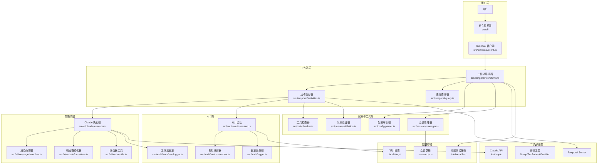
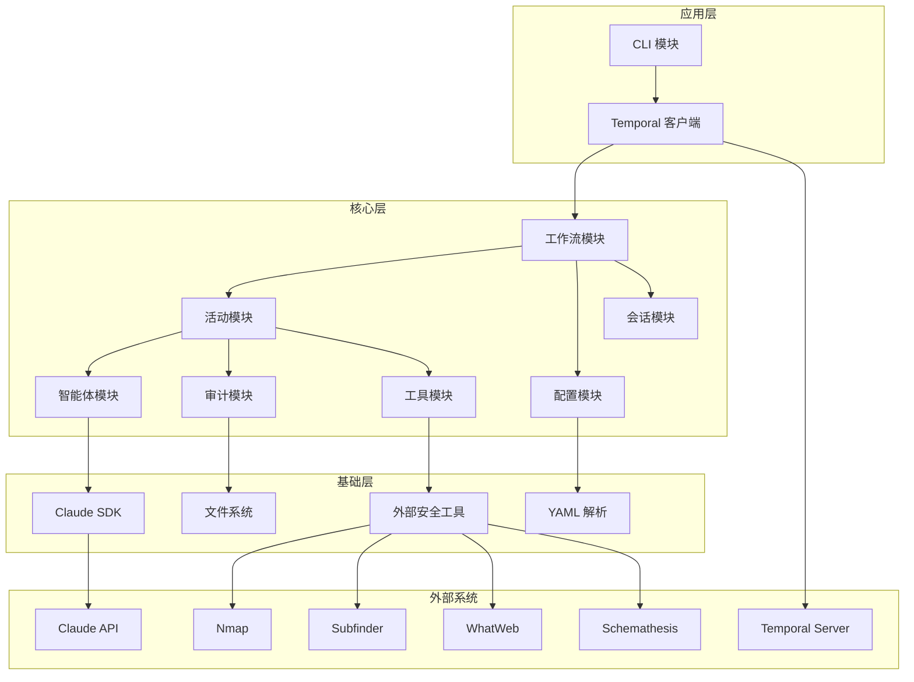

# Shannon 项目架构概述

## 文档信息

| 项目 | 内容 |
|------|------|
| 文档版本 | 1.0.0 |
| 创建日期 | 2026-02-12 |
| 最后更新 | 2026-02-12 |
| 文档状态 | 正式发布 |
| 作者 | 系统生成 |

---

## 目录

- [1. 架构设计理念](#1-架构设计理念)
- [2. 架构模式选择依据](#2-架构模式选择依据)
- [3. 核心组件关系图](#3-核心组件关系图)
- [4. 关键技术决策说明](#4-关键技术决策说明)
- [5. 架构演进规划](#5-架构演进规划)

---

## 1. 架构设计理念

### 1.1 项目定位

Shannon 是一款 AI 渗透测试工具，旨在模拟人类渗透测试人员的工作流程，提供实际的漏洞利用而不仅仅是警报。其核心价值在于：

- **自主操作**：使用单个命令启动完整的渗透测试流程
- **漏洞利用证明**：执行真实的漏洞利用，消除误报
- **代码感知**：结合白盒源代码分析和黑盒动态测试
- **专业报告**：生成可重现、可操作的渗透测试报告

### 1.2 设计原则

#### 1.2.1 模块化设计

系统采用模块化设计，各模块职责单一、边界清晰：

- **CLI 模块**：负责用户交互和命令解析
- **工作流模块**：负责渗透测试流程编排
- **智能体模块**：负责与 AI 模型交互
- **审计模块**：负责日志记录和指标跟踪
- **工具模块**：负责安全工具执行

#### 1.2.2 分层架构

系统采用分层架构，层次分明：

- **表现层**：CLI 命令行界面
- **应用层**：工作流编排和协调
- **领域层**：渗透测试核心逻辑
- **基础设施层**：工具执行和数据存储

#### 1.2.3 事件驱动

系统采用事件驱动架构，通过 Temporal 工作流协调各阶段执行：

- 工作流事件触发活动执行
- 活动完成触发下一阶段
- 错误事件触发重试或回滚

### 1.3 架构特点

#### 1.3.1 多智能体协作

Shannon 采用多智能体架构，模拟人类渗透测试团队：

- **侦察智能体**：负责信息收集和攻击面分析
- **漏洞分析智能体**：负责识别潜在漏洞
- **漏洞利用智能体**：负责验证漏洞真实性
- **报告智能体**：负责生成渗透测试报告

#### 1.3.2 并行处理

系统支持并行处理，提高测试效率：

- 多个漏洞类型同时分析
- 多个漏洞利用同时执行
- 资源争用通过互斥锁保护

#### 1.3.3 容错机制

系统具备完善的容错机制：

- 工作流级别的错误处理
- 活动级别的重试机制
- Git 检查点和回滚支持

---

## 2. 架构模式选择依据

### 2.1 多智能体架构

#### 选择原因

1. **模拟人类工作流程**：渗透测试是一个复杂的多阶段过程，需要不同专业领域的智能体协作完成
2. **并行处理能力**：多个智能体可以并行工作，提高测试效率
3. **职责分明**：每个智能体专注于特定任务，提高专业性
4. **可扩展性**：可以轻松添加新的智能体类型

#### 优势

- 并行处理能力强
- 职责分明，易于维护
- 可扩展性好
- 模拟真实渗透测试团队

#### 劣势

- 复杂性较高
- 需要协调多个智能体的工作
- 资源消耗较大

### 2.2 工作流管理架构

#### 选择原因

1. **长时间运行**：渗透测试可能需要 1-1.5 小时，需要可靠的状态管理
2. **错误处理**：需要完善的错误处理和重试机制
3. **可观测性**：需要实时监控工作流执行状态
4. **可恢复性**：支持从失败点恢复执行

#### 优势

- 提供工作流编排、错误处理和重试机制
- 支持长时间运行的任务
- 提供实时监控和查询能力
- 支持工作流恢复和回滚

#### 劣势

- 增加了系统复杂性
- 需要额外的 Temporal Server 依赖
- 学习曲线较陡

### 2.3 容器化部署架构

#### 选择原因

1. **环境一致性**：确保在不同环境中运行一致
2. **依赖管理**：简化安全工具的安装和配置
3. **安全性**：提供环境隔离，保护主机系统
4. **可移植性**：支持在不同平台运行

#### 优势

- 环境隔离，依赖管理简单
- 部署便捷，可移植性好
- 提高安全性
- 支持资源限制

#### 劣势

- 增加了一定的资源开销
- 需要学习 Docker 知识
- 网络配置相对复杂

---

## 3. 核心组件关系图

### 3.1 系统整体架构图

### 3.2 组件层次结构图

### 3.3 核心组件说明

#### 3.3.1 CLI 模块

| 组件 | 文件 | 职责 |
|------|------|------|
| 命令解析器 | src/cli/ | 解析用户命令和参数 |
| 用户界面 | src/cli/ui.ts | 提供命令行交互界面 |
| 输入验证器 | src/cli/input-validator.ts | 验证用户输入 |

#### 3.3.2 工作流模块

| 组件 | 文件 | 职责 |
|------|------|------|
| 客户端 | src/temporal/client.ts | 启动工作流 |
| 工作流定义 | src/temporal/workflows.ts | 定义渗透测试工作流 |
| 活动定义 | src/temporal/activities.ts | 定义具体活动 |
| 工作器 | src/temporal/worker.ts | 执行工作流和活动 |
| 查询器 | src/temporal/query.ts | 查询工作流状态 |

#### 3.3.3 智能体模块

| 组件 | 文件 | 职责 |
|------|------|------|
| Claude 执行器 | src/ai/claude-executor.ts | 与 Claude API 交互 |
| 消息处理器 | src/ai/message-handlers.ts | 处理智能体消息 |
| 输出格式化器 | src/ai/output-formatters.ts | 格式化智能体输出 |
| 路由器工具 | src/ai/router-utils.ts | 支持多模型路由 |

#### 3.3.4 审计模块

| 组件 | 文件 | 职责 |
|------|------|------|
| 审计会话 | src/audit/audit-session.ts | 管理审计会话 |
| 工作流日志 | src/audit/workflow-logger.ts | 记录工作流事件 |
| 指标跟踪器 | src/audit/metrics-tracker.ts | 跟踪执行指标 |
| 日志记录器 | src/audit/logger.ts | 提供日志功能 |

---

## 4. 关键技术决策说明

### 4.1 选择 Temporal.io 作为工作流管理系统

#### 决策理由

1. **可靠性**：Temporal 提供持久化工作流，即使服务重启也能恢复执行
2. **可观测性**：提供 Web UI 实时监控工作流执行状态
3. **错误处理**：内置重试机制和错误处理策略
4. **长时间运行**：支持长时间运行的工作流（小时级别）

#### 影响分析

| 方面 | 正面影响 | 负面影响 |
|------|----------|----------|
| 可靠性 | 大幅提高工作流可靠性 | 需要额外的 Temporal Server |
| 可维护性 | 工作流状态清晰可见 | 增加系统复杂性 |
| 开发效率 | 减少错误处理代码 | 学习曲线较陡 |

#### 替代方案

| 方案 | 优势 | 劣势 |
|------|------|------|
| 简单脚本 | 简单直接 | 无状态管理，不可靠 |
| 消息队列 | 解耦性好 | 无工作流编排能力 |
| 状态机 | 可控性强 | 需要自己实现持久化 |

### 4.2 选择 Anthropic Claude 作为 AI 模型

#### 决策理由

1. **代码理解能力**：Claude 在代码理解和安全分析方面表现出色
2. **Agent SDK**：提供专门的 Agent SDK，简化智能体开发
3. **长上下文**：支持长上下文窗口，适合复杂分析任务
4. **安全性**：Claude 在安全相关任务中表现可靠

#### 影响分析

| 方面 | 正面影响 | 负面影响 |
|------|----------|----------|
| 准确性 | 提高漏洞识别准确率 | 依赖外部 API |
| 深度 | 支持深度代码分析 | API 成本较高 |
| 开发效率 | SDK 简化开发工作 | 可能受 API 限制 |

#### 替代方案

| 方案 | 优势 | 劣势 |
|------|------|------|
| OpenAI GPT | 生态成熟 | 安全分析能力较弱 |
| 开源模型 | 可本地部署 | 能力有限 |
| 规则引擎 | 可控性强 | 无法处理复杂场景 |

### 4.3 采用容器化部署

#### 决策理由

1. **环境一致性**：确保在不同环境中运行一致
2. **依赖管理**：简化安全工具的安装和配置
3. **安全性**：提供环境隔离，保护主机系统
4. **可移植性**：支持在不同平台运行

#### 影响分析

| 方面 | 正面影响 | 负面影响 |
|------|----------|----------|
| 部署 | 简化部署流程 | 需要 Docker 知识 |
| 安全 | 提供环境隔离 | 增加资源开销 |
| 维护 | 环境一致性好 | 调试相对复杂 |

#### 替代方案

| 方案 | 优势 | 劣势 |
|------|------|------|
| 本地安装 | 性能好 | 环境不一致 |
| 虚拟机 | 隔离性好 | 资源开销大 |
| 云服务 | 无需部署 | 成本高，隐私问题 |

### 4.4 使用多阶段构建

#### 决策理由

1. **镜像大小**：减少最终镜像大小，提高部署效率
2. **安全性**：移除构建工具，减少攻击面
3. **清晰性**：构建和运行环境分离，职责清晰

#### 影响分析

| 方面 | 正面影响 | 负面影响 |
|------|----------|----------|
| 镜像大小 | 大幅减少 | 构建时间增加 |
| 安全性 | 减少攻击面 | 构建配置复杂 |
| 维护性 | 环境清晰 | 需要理解多阶段构建 |

---

## 5. 架构演进规划

### 5.1 近期规划（1-3 个月）

#### 5.1.1 功能增强

| 目标 | 描述 | 优先级 |
|------|------|--------|
| 扩展漏洞类型 | 支持更多 OWASP 漏洞类型 | 高 |
| CI/CD 集成 | 提供与主流 CI/CD 系统的集成 | 高 |
| 报告改进 | 增强报告生成功能，支持更多格式 | 中 |

#### 5.1.2 性能优化

| 目标 | 描述 | 优先级 |
|------|------|--------|
| 并行优化 | 优化并行执行策略 | 高 |
| 缓存机制 | 实现智能体响应缓存 | 中 |
| 资源管理 | 优化内存和 CPU 使用 | 中 |

#### 5.1.3 用户体验

| 目标 | 描述 | 优先级 |
|------|------|--------|
| 进度展示 | 改进进度展示和实时反馈 | 高 |
| 错误提示 | 提供更友好的错误提示 | 中 |
| 文档完善 | 完善用户文档和示例 | 中 |

### 5.2 中期规划（3-6 个月）

#### 5.2.1 技术升级

| 目标 | 描述 | 优先级 |
|------|------|--------|
| 数据流分析 | 实现更高级的数据流分析引擎 | 高 |
| 多模型支持 | 支持更多 AI 模型和提供商 | 中 |
| 自动修复 | 提供自动化修复建议 | 中 |

#### 5.2.2 架构优化

| 目标 | 描述 | 优先级 |
|------|------|--------|
| 插件架构 | 实现插件系统，支持扩展 | 高 |
| API 服务 | 提供 REST API 接口 | 中 |
| 分布式执行 | 支持分布式执行和调度 | 低 |

#### 5.2.3 安全增强

| 目标 | 描述 | 优先级 |
|------|------|--------|
| 认证授权 | 实现用户认证和授权 | 高 |
| 审计日志 | 增强审计日志功能 | 中 |
| 数据加密 | 支持敏感数据加密 | 中 |

### 5.3 长期规划（6-12 个月）

#### 5.3.1 平台化

| 目标 | 描述 | 优先级 |
|------|------|--------|
| 合规平台 | 构建完整的安全与合规平台 | 高 |
| 多租户 | 支持多租户架构 | 中 |
| SaaS 服务 | 提供 SaaS 服务选项 | 低 |

#### 5.3.2 智能化

| 目标 | 描述 | 优先级 |
|------|------|--------|
| 自动修复 | 实现自动化漏洞修复 | 高 |
| 智能推荐 | 提供智能安全建议 | 中 |
| 预测分析 | 实现安全风险预测 | 低 |

#### 5.3.3 生态建设

| 目标 | 描述 | 优先级 |
|------|------|--------|
| 插件市场 | 建立插件生态系统 | 高 |
| 社区建设 | 建设开发者社区 | 中 |
| 培训认证 | 提供培训和认证服务 | 低 |

### 5.4 技术债务管理

#### 5.4.1 当前技术债务

| 债务类型 | 描述 | 影响 | 优先级 |
|----------|------|------|--------|
| 测试覆盖 | 单元测试覆盖率不足 | 中 | 高 |
| 文档完善 | 部分模块文档不完整 | 低 | 中 |
| 代码重构 | 部分代码需要重构 | 低 | 低 |

#### 5.4.2 债务清理计划

| 阶段 | 目标 | 时间 |
|------|------|------|
| 第一阶段 | 提高测试覆盖率到 60% | 1 个月 |
| 第二阶段 | 完善所有模块文档 | 2 个月 |
| 第三阶段 | 重构核心模块 | 3 个月 |

---

## 附录

### A. 架构决策记录（ADR）

#### ADR-001: 选择 Temporal.io

- **状态**：已采纳
- **日期**：项目启动
- **决策**：使用 Temporal.io 作为工作流管理系统
- **理由**：提供可靠的工作流编排，支持长时间运行的任务
- **后果**：增加了系统复杂性，但提高了可靠性

#### ADR-002: 选择 Anthropic Claude

- **状态**：已采纳
- **日期**：项目启动
- **决策**：使用 Anthropic Claude 作为主要 AI 模型
- **理由**：Claude 在代码理解和安全分析方面表现出色
- **后果**：依赖外部 API，但提高了分析准确性

#### ADR-003: 采用容器化部署

- **状态**：已采纳
- **日期**：项目启动
- **决策**：使用 Docker 容器化部署
- **理由**：确保环境一致性，简化依赖管理
- **后果**：增加了一定的资源开销，但提高了可移植性

### B. 参考资料

1. [Temporal.io 官方文档](https://docs.temporal.io/)
2. [Anthropic Claude API 文档](https://docs.anthropic.com/)
3. [Docker 官方文档](https://docs.docker.com/)
4. [OWASP Top 10](https://owasp.org/www-project-top-ten/)
5. [软件架构模式](https://www.oreilly.com/library/view/software-architecture-patterns/9781491971437/)

---

## 文档修订历史

| 版本 | 日期 | 修订内容 | 作者 |
|------|------|----------|------|
| 1.0.0 | 2026-02-12 | 初始版本 | 系统生成 |
