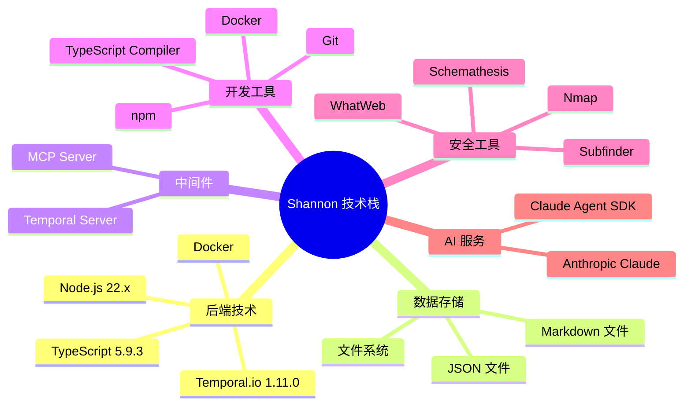

# Shannon 技术栈说明

## 文档信息

| 项目 | 内容 |
|------|------|
| 文档版本 | 1.0.0 |
| 创建日期 | 2026-02-12 |
| 最后更新 | 2026-02-12 |
| 文档状态 | 正式发布 |
| 作者 | purpose168 |

---

## 目录

- [1. 技术栈概览](#1-技术栈概览)
- [2. 后端技术](#2-后端技术)
- [3. 数据存储](#3-数据存储)
- [4. 中间件](#4-中间件)
- [5. 开发工具](#5-开发工具)
- [6. 安全工具](#6-安全工具)
- [7. 兼容性要求](#7-兼容性要求)
- [8. 技术选型理由](#8-技术选型理由)

---

## 1. 技术栈概览

### 1.1 技术栈全景图



### 1.2 技术栈清单

| 层次 | 技术 | 版本 | 用途 |
|------|------|------|------|
| 编程语言 | TypeScript | 5.9.3 | 主要开发语言 |
| 运行环境 | Node.js | 22.x | JavaScript 运行时 |
| 工作流引擎 | Temporal.io | 1.11.0 | 工作流管理 |
| 容器化 | Docker | 20.10.0+ | 容器运行时 |
| AI 服务 | Anthropic Claude | Claude 4+ | AI 模型 |
| 包管理 | npm | 9.x+ | 依赖管理 |
| 版本控制 | Git | 2.x+ | 代码版本管理 |

---

## 2. 后端技术

### 2.1 编程语言

#### TypeScript 5.9.3

| 项目 | 内容 |
|------|------|
| 版本 | 5.9.3 |
| 用途 | 主要开发语言 |
| 选型理由 | 类型安全，提高代码质量和可维护性；优秀的 IDE 支持；与 JavaScript 生态完全兼容 |
| 配置文件 | tsconfig.json |

**编译配置**：

```json
{
  "compilerOptions": {
    "target": "ES2022",
    "module": "ES2022",
    "moduleResolution": "node",
    "strict": true,
    "esModuleInterop": true,
    "skipLibCheck": true,
    "forceConsistentCasingInFileNames": true,
    "outDir": "./dist",
    "rootDir": "./src"
  }
}
```

#### Node.js 22.x

| 项目 | 内容 |
|------|------|
| 版本 | 22.x |
| 用途 | JavaScript 运行时 |
| 选型理由 | 跨平台，生态丰富，适合构建 CLI 工具；支持 ES 模块；性能优秀 |
| 运行模式 | ES 模块（ESM） |

**运行配置**：

```json
{
  "type": "module"
}
```

### 2.2 核心框架

#### Temporal.io 1.11.0

| 项目 | 内容 |
|------|------|
| 版本 | 1.11.0 |
| 用途 | 工作流管理系统 |
| 选型理由 | 提供可靠的工作流编排，支持长时间运行的任务，具有错误处理和重试机制 |
| 组件 | @temporalio/client, @temporalio/worker, @temporalio/workflow, @temporalio/activity |

**核心功能**：

- 工作流定义和编排
- 活动执行和监控
- 错误处理和重试
- 工作流状态查询
- 长时间运行支持

#### Claude Agent SDK 0.2.38

| 项目 | 内容 |
|------|------|
| 版本 | ^0.2.38 |
| 用途 | Claude 智能体 SDK |
| 选型理由 | 提供专门的 Agent SDK，简化智能体开发；支持工具调用和消息处理 |
| 包名 | @anthropic-ai/claude-agent-sdk |

**核心功能**：

- 智能体创建和管理
- 工具定义和调用
- 消息处理和路由
- 流式响应支持

### 2.3 工具库

#### 数据验证

| 库名 | 版本 | 用途 | 选型理由 |
|------|------|------|----------|
| ajv | ^8.12.0 | JSON Schema 验证 | 性能优秀，支持最新的 JSON Schema 规范 |
| ajv-formats | ^2.1.1 | AJV 格式验证 | 提供 JSON Schema 格式验证支持 |
| zod | ^4.3.6 | 运行时类型验证 | TypeScript 优先，类型推断优秀 |

#### 配置管理

| 库名 | 版本 | 用途 | 选型理由 |
|------|------|------|----------|
| js-yaml | ^4.1.0 | YAML 解析 | 稳定可靠，支持 YAML 1.2 规范 |
| dotenv | ^16.4.5 | 环境变量加载 | 简单易用，广泛使用 |

#### 终端工具

| 库名 | 版本 | 用途 | 选型理由 |
|------|------|------|----------|
| chalk | ^5.0.0 | 终端文本颜色 | 功能丰富，支持链式调用 |
| boxen | ^8.0.1 | 终端文本框 | 创建美观的文本框 |
| figlet | ^1.9.3 | 终端大字 | ASCII 艺术字体 |
| gradient-string | ^3.0.0 | 终端渐变文本 | 创建渐变效果 |

#### 脚本执行

| 库名 | 版本 | 用途 | 选型理由 |
|------|------|------|----------|
| zx | ^8.0.0 | 脚本执行 | Google 出品，支持 Bash 风格脚本 |

---

## 3. 数据存储

### 3.1 存储方案概述

Shannon 项目不使用传统数据库，所有数据存储在文件系统中：

| 数据类型 | 存储位置 | 存储格式 | 说明 |
|----------|----------|----------|------|
| 审计日志 | ./audit-logs/ | JSON + 文本 | 工作流事件、智能体执行日志 |
| 会话数据 | session.json | JSON | 会话配置、执行状态、指标数据 |
| 报告数据 | ./deliverables/ | Markdown | 渗透测试报告、漏洞详情 |
| 配置数据 | ./configs/ | YAML | 用户配置文件 |

### 3.2 文件系统存储

#### 目录结构

```
audit-logs/
├── {hostname}_{sessionId}/
│   ├── session.json          # 会话数据
│   ├── workflow.log          # 工作流日志
│   ├── agents/               # 智能体日志
│   │   ├── reconnaissance.log
│   │   ├── vulnerability-analysis.log
│   │   └── exploitation.log
│   ├── prompts/              # 提示快照
│   └── deliverables/         # 交付物
│       └── comprehensive_security_assessment_report.md
```

#### 数据格式

**session.json**：

```json
{
  "sessionId": "shannon-1234567890",
  "targetUrl": "https://example.com",
  "repo": "example-repo",
  "status": "running",
  "startTime": "2026-02-12T10:00:00Z",
  "errors": [],
  "agentMetrics": {
    "totalCost": 0,
    "totalTurns": 0,
    "totalTime": 0
  }
}
```

### 3.3 数据持久化策略

#### 原子写入

为确保数据完整性，所有文件写入采用原子操作：

1. 写入临时文件
2. 验证写入成功
3. 原子重命名到目标文件

#### 数据备份

- 定期备份审计日志目录
- 支持从备份恢复会话数据
- 建议配置自动备份策略

---

## 4. 中间件

### 4.1 Temporal Server

| 项目 | 内容 |
|------|------|
| 版本 | 1.11.0 |
| 用途 | 工作流执行引擎 |
| 选型理由 | 提供工作流编排、错误处理和状态管理 |
| 部署方式 | Docker 容器 |

**配置要点**：

- 默认端口：7233
- Web UI：http://localhost:8233
- 命名空间：default

**Docker Compose 配置**：

```yaml
services:
  temporal:
    image: temporalio/auto-setup:latest
    ports:
      - "7233:7233"
      - "8233:8233"
    environment:
      - DB=postgresql
      - DB_PORT=5432
```

### 4.2 MCP Server

| 项目 | 内容 |
|------|------|
| 用途 | Claude 模型上下文协议服务器 |
| 选型理由 | 提供浏览器自动化能力，支持复杂的交互场景 |
| 部署方式 | 内嵌在主容器中 |

**核心功能**：

- 浏览器自动化
- 网页交互
- 表单填写
- 截图和验证

**配置要点**：

- 使用 `--isolated` 模式
- 配置唯一的 `--user-data-dir`
- 预装 Chromium 浏览器

---

## 5. 开发工具

### 5.1 构建工具

#### TypeScript Compiler

| 项目 | 内容 |
|------|------|
| 版本 | 5.9.3 |
| 用途 | 代码编译 |
| 配置文件 | tsconfig.json |

**构建命令**：

```bash
npm run build
```

#### npm

| 项目 | 内容 |
|------|------|
| 版本 | 9.x+ |
| 用途 | 包管理 |
| 配置文件 | package.json, package-lock.json |

**常用命令**：

```bash
npm install          # 安装依赖
npm ci               # 清洁安装（推荐用于 CI/CD）
npm run build        # 构建项目
npm run temporal:server    # 启动 Temporal Server
npm run temporal:worker    # 启动 Temporal Worker
```

### 5.2 版本控制

#### Git

| 项目 | 内容 |
|------|------|
| 版本 | 2.x+ |
| 用途 | 代码版本管理 |
| 配置文件 | .gitignore |

**Git 配置**：

```bash
git config --global user.email "agent@localhost"
git config --global user.name "Pentest Agent"
git config --global --add safe.directory '*'
```

**Git 功能使用**：

- 创建检查点
- 回滚工作区
- 提交更改

### 5.3 容器化工具

#### Docker

| 项目 | 内容 |
|------|------|
| 版本 | 20.10.0+ |
| 用途 | 容器运行时 |
| 配置文件 | Dockerfile, docker-compose.yml |

**Docker 功能**：

- 多阶段构建
- 环境隔离
- 依赖管理
- 资源限制

---

## 6. 安全工具

### 6.1 网络扫描工具

#### Nmap

| 项目 | 内容 |
|------|------|
| 版本 | 最新版 |
| 用途 | 网络扫描 |
| 安装方式 | apk install nmap |
| 主要功能 | 端口扫描、服务识别、漏洞检测 |

**常用命令**：

```bash
nmap -sV -p- target.com
```

#### Subfinder

| 项目 | 内容 |
|------|------|
| 版本 | 最新版 |
| 用途 | 子域名发现 |
| 安装方式 | go install github.com/projectdiscovery/subfinder/v2/cmd/subfinder@latest |
| 主要功能 | 被动子域名枚举 |

**常用命令**：

```bash
subfinder -d target.com
```

### 6.2 Web 识别工具

#### WhatWeb

| 项目 | 内容 |
|------|------|
| 版本 | 最新版 |
| 用途 | 网站指纹识别 |
| 安装方式 | git clone https://github.com/urbanadventurer/WhatWeb.git |
| 主要功能 | 识别网站技术栈、CMS、服务器等 |

**常用命令**：

```bash
whatweb https://target.com
```

### 6.3 API 测试工具

#### Schemathesis

| 项目 | 内容 |
|------|------|
| 版本 | 最新版 |
| 用途 | API 测试 |
| 安装方式 | pip3 install schemathesis |
| 主要功能 | 基于 OpenAPI 规范的自动化 API 测试 |

**常用命令**：

```bash
schemathesis run openapi.json
```

### 6.4 浏览器自动化

#### Playwright

| 项目 | 内容 |
|------|------|
| 版本 | 内置 |
| 用途 | 浏览器自动化 |
| 安装方式 | Docker 镜像内置 |
| 主要功能 | 网页交互、表单填写、截图验证 |

**配置要点**：

- 使用 Chromium 浏览器
- 无头模式运行
- 支持复杂的用户交互

---

## 7. 兼容性要求

### 7.1 系统要求

| 组件 | 最低要求 | 推荐配置 | 说明 |
|------|----------|----------|------|
| 操作系统 | Linux/macOS/Windows | Linux | 支持 WSL2 |
| Docker | 20.10.0+ | 最新版 | 容器运行时 |
| 内存 | 4 GB | 8 GB+ | 运行容器和工具 |
| 磁盘 | 10 GB | 20 GB+ | 存储日志和报告 |
| CPU | 2 核 | 4 核+ | 并行处理 |

### 7.2 软件兼容性

| 组件 | 兼容版本 | 说明 |
|------|----------|------|
| Node.js | 22.x | 运行环境 |
| TypeScript | 5.9.3 | 开发环境 |
| Anthropic API | Claude 4+ | AI 模型 |
| Temporal Server | 1.11.0 | 工作流管理 |
| Docker | 20.10.0+ | 容器运行时 |

### 7.3 平台特定说明

#### Linux

- 使用 `sudo` 运行 Docker 命令（如果需要）
- 确保用户有 Docker 套接字访问权限

#### macOS

- 安装 Docker Desktop
- 支持 Apple Silicon (M1/M2)

#### Windows

- 使用 WSL2 运行
- 安装 Docker Desktop for Windows
- 注意 Windows Defender 误报

---

## 8. 技术选型理由

### 8.1 选择 TypeScript

| 维度 | 理由 |
|------|------|
| 类型安全 | 编译时类型检查，减少运行时错误 |
| 开发效率 | 优秀的 IDE 支持，智能提示和重构 |
| 生态兼容 | 与 JavaScript 生态完全兼容 |
| 可维护性 | 类型定义即文档，提高代码可读性 |

### 8.2 选择 Temporal.io

| 维度 | 理由 |
|------|------|
| 可靠性 | 持久化工作流，支持故障恢复 |
| 可观测性 | Web UI 实时监控工作流状态 |
| 长时间运行 | 支持小时级别的工作流 |
| 错误处理 | 内置重试机制和错误处理策略 |

### 8.3 选择 Anthropic Claude

| 维度 | 理由 |
|------|------|
| 代码理解 | 在代码理解和安全分析方面表现出色 |
| Agent SDK | 提供专门的 Agent SDK，简化开发 |
| 长上下文 | 支持长上下文窗口，适合复杂分析 |
| 安全性 | 在安全相关任务中表现可靠 |

### 8.4 选择 Docker

| 维度 | 理由 |
|------|------|
| 环境一致性 | 确保在不同环境中运行一致 |
| 依赖管理 | 简化安全工具的安装和配置 |
| 安全性 | 提供环境隔离，保护主机系统 |
| 可移植性 | 支持在不同平台运行 |

### 8.5 选择文件系统存储

| 维度 | 理由 |
|------|------|
| 简单性 | 不需要额外的数据库服务 |
| 可移植性 | 数据以文件形式存储，易于备份和迁移 |
| 调试友好 | 可以直接查看和编辑文件 |
| 成本低 | 无需额外的数据库许可和维护成本 |

---

## 附录

### A. 依赖清单

#### 生产依赖

| 依赖 | 版本 | 用途 |
|------|------|------|
| @anthropic-ai/claude-agent-sdk | ^0.2.38 | Claude 智能体 SDK |
| @temporalio/activity | ^1.11.0 | Temporal 活动 |
| @temporalio/client | ^1.11.0 | Temporal 客户端 |
| @temporalio/worker | ^1.11.0 | Temporal 工作器 |
| @temporalio/workflow | ^1.11.0 | Temporal 工作流 |
| ajv | ^8.12.0 | JSON Schema 验证 |
| ajv-formats | ^2.1.1 | AJV 格式验证 |
| boxen | ^8.0.1 | 终端文本框 |
| chalk | ^5.0.0 | 终端文本颜色 |
| dotenv | ^16.4.5 | 环境变量加载 |
| figlet | ^1.9.3 | 终端大字 |
| gradient-string | ^3.0.0 | 终端渐变文本 |
| js-yaml | ^4.1.0 | YAML 解析 |
| zod | ^4.3.6 | 数据验证 |
| zx | ^8.0.0 | 脚本执行 |

#### 开发依赖

| 依赖 | 版本 | 用途 |
|------|------|------|
| @types/js-yaml | ^4.0.9 | YAML 类型定义 |
| @types/node | ^25.0.3 | Node.js 类型定义 |
| typescript | ^5.9.3 | TypeScript 编译器 |

### B. 环境变量

| 环境变量 | 描述 | 必需 | 默认值 |
|----------|------|------|--------|
| ANTHROPIC_API_KEY | Anthropic API 密钥 | 否（二选一） | - |
| CLAUDE_CODE_OAUTH_TOKEN | Claude Code OAuth 令牌 | 否（二选一） | - |
| OPENAI_API_KEY | OpenAI API 密钥（实验性） | 否 | - |
| OPENROUTER_API_KEY | OpenRouter API 密钥（实验性） | 否 | - |
| ROUTER_DEFAULT | 默认路由模型（实验性） | 否 | - |
| NODE_ENV | Node.js 环境 | 否 | production |
| SHANNON_DOCKER | 是否在 Docker 中运行 | 否 | false |
| PLAYWRIGHT_SKIP_BROWSER_DOWNLOAD | 是否跳过浏览器下载 | 否 | 1 |
| PLAYWRIGHT_CHROMIUM_EXECUTABLE_PATH | Chromium 可执行文件路径 | 否 | /usr/bin/chromium-browser |

### C. 参考资料

1. [TypeScript 官方文档](https://www.typescriptlang.org/docs/)
2. [Node.js 官方文档](https://nodejs.org/docs/)
3. [Temporal.io 官方文档](https://docs.temporal.io/)
4. [Anthropic API 文档](https://docs.anthropic.com/)
5. [Docker 官方文档](https://docs.docker.com/)

---

## 文档修订历史

| 版本 | 日期 | 修订内容 | 作者 |
|------|------|----------|------|
| 1.0.0 | 2026-02-12 | 初始版本 | purpose168 |
