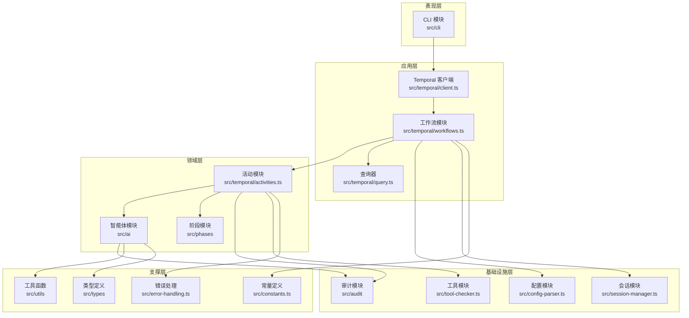
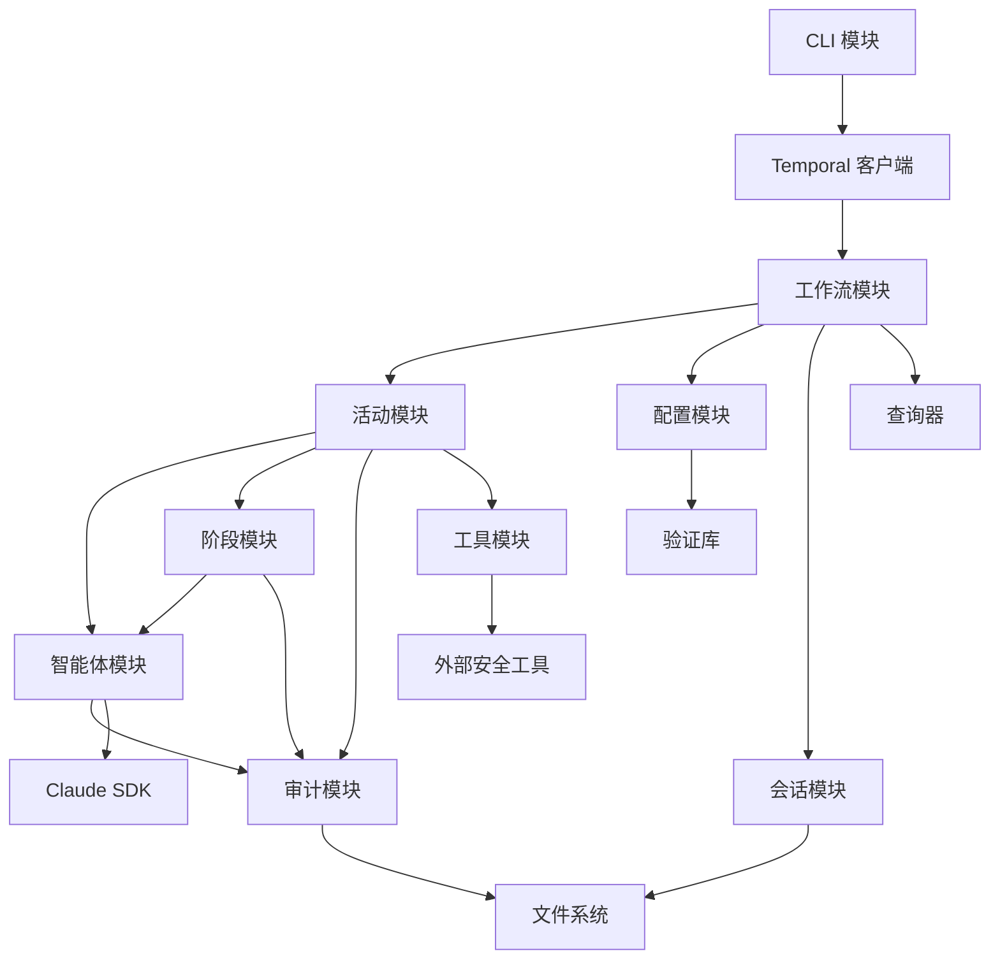

# Shannon 模块划分

## 文档信息

| 项目 | 内容 |
|------|------|
| 文档版本 | 1.0.0 |
| 创建日期 | 2026-02-12 |
| 最后更新 | 2026-02-12 |
| 文档状态 | 正式发布 |
| 作者 | 系统生成 |

---

## 目录

- [1. 模块划分原则](#1-模块划分原则)
- [2. 核心模块说明](#2-核心模块说明)
- [3. 模块层次结构图](#3-模块层次结构图)
- [4. 模块依赖关系](#4-模块依赖关系)
- [5. 模块详细设计](#5-模块详细设计)

---

## 1. 模块划分原则

### 1.1 领域驱动设计原则

Shannon 项目基于领域驱动设计（DDD）原则进行模块划分，确保各模块职责单一、边界清晰，便于维护和扩展。

#### 1.1.1 分层架构

| 层次 | 职责 | 模块 |
|------|------|------|
| 表现层 | 用户交互和界面展示 | CLI 模块 |
| 应用层 | 工作流编排和协调 | 工作流模块 |
| 领域层 | 核心业务逻辑 | 智能体模块、工具模块 |
| 基础设施层 | 技术支持和数据存储 | 审计模块、配置模块 |

#### 1.1.2 模块边界

- **高内聚**：模块内部元素紧密相关
- **低耦合**：模块间依赖最小化
- **单一职责**：每个模块只负责一个业务领域
- **接口隔离**：通过明确的接口进行模块间通信

### 1.2 模块分类标准

#### 1.2.1 按业务功能分类

| 模块类型 | 描述 | 示例 |
|----------|------|------|
| 核心模块 | 实现核心业务逻辑 | 智能体模块、工作流模块 |
| 支撑模块 | 提供技术支持 | 审计模块、配置模块 |
| 工具模块 | 提供工具函数 | 工具模块、队列验证模块 |

#### 1.2.2 按技术层次分类

| 层次 | 模块 | 职责 |
|------|------|------|
| 应用层 | CLI 模块 | 用户交互 |
| 核心层 | 工作流模块、智能体模块 | 业务逻辑 |
| 基础层 | 审计模块、配置模块 | 技术支持 |

---

## 2. 核心模块说明

### 2.1 CLI 模块

#### 2.1.1 模块概述

| 项目 | 内容 |
|------|------|
| 模块名称 | CLI 模块 |
| 模块路径 | src/cli/ |
| 模块类型 | 表现层模块 |
| 主要职责 | 用户交互和命令解析 |

#### 2.1.2 核心功能

| 功能 | 描述 | 文件 |
|------|------|------|
| 命令解析 | 解析用户命令和参数 | src/cli/ |
| 用户界面 | 提供命令行交互界面 | src/cli/ui.ts |
| 输入验证 | 验证用户输入 | src/cli/input-validator.ts |

#### 2.1.3 职责边界

- **负责**：解析用户命令、验证输入、启动工作流、展示结果
- **不负责**：业务逻辑处理、数据持久化

#### 2.1.4 依赖关系

| 依赖模块 | 依赖类型 | 说明 |
|----------|----------|------|
| Temporal 客户端 | 直接依赖 | 启动工作流 |

### 2.2 工作流模块

#### 2.2.1 模块概述

| 项目 | 内容 |
|------|------|
| 模块名称 | 工作流模块 |
| 模块路径 | src/temporal/ |
| 模块类型 | 应用层模块 |
| 主要职责 | 渗透测试工作流编排 |

#### 2.2.2 核心功能

| 功能 | 描述 | 文件 |
|------|------|------|
| 客户端 | 启动工作流 | src/temporal/client.ts |
| 工作流定义 | 定义渗透测试工作流 | src/temporal/workflows.ts |
| 活动定义 | 定义具体活动 | src/temporal/activities.ts |
| 工作器 | 执行工作流和活动 | src/temporal/worker.ts |
| 查询器 | 查询工作流状态 | src/temporal/query.ts |
| 共享类型 | 定义共享类型 | src/temporal/shared.ts |

#### 2.2.3 职责边界

- **负责**：工作流编排、活动协调、错误处理、状态管理
- **不负责**：具体的智能体执行、工具调用

#### 2.2.4 依赖关系

| 依赖模块 | 依赖类型 | 说明 |
|----------|----------|------|
| 活动模块 | 直接依赖 | 执行具体活动 |
| 配置模块 | 直接依赖 | 加载配置 |
| 会话模块 | 直接依赖 | 管理会话 |

### 2.3 智能体模块

#### 2.3.1 模块概述

| 项目 | 内容 |
|------|------|
| 模块名称 | 智能体模块 |
| 模块路径 | src/ai/ |
| 模块类型 | 领域层模块 |
| 主要职责 | 与 AI 模型交互 |

#### 2.3.2 核心功能

| 功能 | 描述 | 文件 |
|------|------|------|
| Claude 执行器 | 与 Claude API 交互 | src/ai/claude-executor.ts |
| 消息处理器 | 处理智能体消息 | src/ai/message-handlers.ts |
| 输出格式化器 | 格式化智能体输出 | src/ai/output-formatters.ts |
| 输出格式化器（备选） | 格式化智能体输出 | src/ai/output-formatter.ts |
| 进度管理器 | 管理执行进度 | src/ai/progress-manager.ts |
| 路由器工具 | 支持多模型路由 | src/ai/router-utils.ts |
| 审计日志器 | 记录智能体审计日志 | src/ai/audit-logger.ts |
| 类型定义 | 定义智能体类型 | src/ai/types.ts |

#### 2.3.3 职责边界

- **负责**：AI 模型调用、消息处理、输出格式化
- **不负责**：工作流编排、工具执行

#### 2.3.4 依赖关系

| 依赖模块 | 依赖类型 | 说明 |
|----------|----------|------|
| 审计模块 | 直接依赖 | 记录执行日志 |
| Claude SDK | 外部依赖 | AI 模型交互 |

### 2.4 审计模块

#### 2.4.1 模块概述

| 项目 | 内容 |
|------|------|
| 模块名称 | 审计模块 |
| 模块路径 | src/audit/ |
| 模块类型 | 基础设施层模块 |
| 主要职责 | 日志记录和指标跟踪 |

#### 2.4.2 核心功能

| 功能 | 描述 | 文件 |
|------|------|------|
| 审计会话 | 管理审计会话 | src/audit/audit-session.ts |
| 工作流日志 | 记录工作流事件 | src/audit/workflow-logger.ts |
| 指标跟踪器 | 跟踪执行指标 | src/audit/metrics-tracker.ts |
| 日志记录器 | 提供日志功能 | src/audit/logger.ts |
| 工具函数 | 提供工具函数 | src/audit/utils.ts |
| 索引 | 模块导出 | src/audit/index.ts |

#### 2.4.3 职责边界

- **负责**：日志记录、指标跟踪、会话管理
- **不负责**：业务逻辑处理

#### 2.4.4 依赖关系

| 依赖模块 | 依赖类型 | 说明 |
|----------|----------|------|
| 无 | - | 基础模块，无直接依赖 |

### 2.5 配置模块

#### 2.5.1 模块概述

| 项目 | 内容 |
|------|------|
| 模块名称 | 配置模块 |
| 模块路径 | src/config-parser.ts |
| 模块类型 | 基础设施层模块 |
| 主要职责 | 配置解析和验证 |

#### 2.5.2 核心功能

| 功能 | 描述 |
|------|------|
| 配置解析 | 解析 YAML 配置文件 |
| 配置验证 | 验证配置有效性 |
| 环境变量加载 | 加载环境变量 |

#### 2.5.3 职责边界

- **负责**：配置加载、验证、合并
- **不负责**：业务逻辑处理

#### 2.5.4 依赖关系

| 依赖模块 | 依赖类型 | 说明 |
|----------|----------|------|
| 验证库 | 外部依赖 | 配置验证 |

### 2.6 工具模块

#### 2.6.1 模块概述

| 项目 | 内容 |
|------|------|
| 模块名称 | 工具模块 |
| 模块路径 | src/tool-checker.ts, src/queue-validation.ts |
| 模块类型 | 支撑模块 |
| 主要职责 | 工具检查和队列验证 |

#### 2.6.2 核心功能

| 功能 | 描述 | 文件 |
|------|------|------|
| 工具检查 | 检查外部工具可用性 | src/tool-checker.ts |
| 队列验证 | 验证交付物队列 | src/queue-validation.ts |

#### 2.6.3 职责边界

- **负责**：工具可用性检查、交付物验证
- **不负责**：业务逻辑处理

#### 2.6.4 依赖关系

| 依赖模块 | 依赖类型 | 说明 |
|----------|----------|------|
| 外部工具 | 外部依赖 | 安全工具 |

### 2.7 会话模块

#### 2.7.1 模块概述

| 项目 | 内容 |
|------|------|
| 模块名称 | 会话模块 |
| 模块路径 | src/session-manager.ts |
| 模块类型 | 支撑模块 |
| 主要职责 | 会话管理 |

#### 2.7.2 核心功能

| 功能 | 描述 |
|------|------|
| 会话创建 | 创建新的渗透测试会话 |
| 会话加载 | 加载现有会话 |
| 会话更新 | 更新会话状态 |

#### 2.7.3 职责边界

- **负责**：会话生命周期管理
- **不负责**：业务逻辑处理

#### 2.7.4 依赖关系

| 依赖模块 | 依赖类型 | 说明 |
|----------|----------|------|
| 文件系统 | 基础依赖 | 会话数据存储 |

---

## 3. 模块层次结构图

### 3.1 整体层次结构



### 3.2 模块层次说明

| 层次 | 模块 | 职责 | 依赖方向 |
|------|------|------|----------|
| 表现层 | CLI 模块 | 用户交互 | 向下依赖 |
| 应用层 | 工作流模块 | 流程编排 | 向下依赖 |
| 领域层 | 智能体模块、阶段模块 | 业务逻辑 | 向下依赖 |
| 基础设施层 | 审计模块、配置模块 | 技术支持 | 向下依赖 |
| 支撑层 | 工具函数、类型定义 | 通用支持 | 无依赖 |

---

## 4. 模块依赖关系

### 4.1 依赖关系图



### 4.2 依赖关系表

| 模块 | 依赖模块 | 依赖类型 | 说明 |
|------|----------|----------|------|
| CLI | Temporal 客户端 | 直接依赖 | 启动工作流 |
| Temporal 客户端 | 工作流 | 直接依赖 | 调用工作流 |
| 工作流 | 活动 | 直接依赖 | 执行活动 |
| 工作流 | 配置 | 直接依赖 | 加载配置 |
| 工作流 | 会话 | 直接依赖 | 管理会话 |
| 活动 | 智能体 | 直接依赖 | 执行智能体 |
| 活动 | 审计 | 直接依赖 | 记录日志 |
| 活动 | 工具 | 直接依赖 | 执行工具 |
| 智能体 | 审计 | 直接依赖 | 记录日志 |
| 智能体 | Claude SDK | 外部依赖 | AI 模型交互 |
| 工具 | 外部安全工具 | 外部依赖 | 安全工具 |

### 4.3 循环依赖检测

经分析，当前模块设计不存在循环依赖：

- 所有依赖关系都是单向的
- 模块层次结构清晰
- 依赖方向遵循分层架构原则

---

## 5. 模块详细设计

### 5.1 CLI 模块详细设计

#### 5.1.1 模块结构

```
src/cli/
├── ui.ts              # 用户界面
└── input-validator.ts # 输入验证
```

#### 5.1.2 核心类/函数

| 名称 | 类型 | 描述 |
|------|------|------|
| parseCommand | 函数 | 解析用户命令 |
| validateInput | 函数 | 验证用户输入 |
| displayHelp | 函数 | 显示帮助信息 |
| displayProgress | 函数 | 显示进度信息 |

### 5.2 工作流模块详细设计

#### 5.2.1 模块结构

```
src/temporal/
├── client.ts      # 客户端
├── workflows.ts   # 工作流定义
├── activities.ts  # 活动定义
├── worker.ts      # 工作器
├── query.ts       # 查询器
└── shared.ts      # 共享类型
```

#### 5.2.2 核心类/函数

| 名称 | 类型 | 描述 |
|------|------|------|
| runPentestWorkflow | 工作流 | 运行完整的渗透测试工作流 |
| runReconnaissance | 活动 | 执行侦察阶段 |
| runVulnerabilityAnalysis | 活动 | 执行漏洞分析 |
| runExploitation | 活动 | 执行漏洞利用 |
| generateReport | 活动 | 生成渗透测试报告 |
| queryWorkflow | 函数 | 查询工作流状态 |

### 5.3 智能体模块详细设计

#### 5.3.1 模块结构

```
src/ai/
├── claude-executor.ts     # Claude 执行器
├── message-handlers.ts    # 消息处理器
├── output-formatters.ts   # 输出格式化器
├── output-formatter.ts    # 输出格式化器（备选）
├── progress-manager.ts    # 进度管理器
├── router-utils.ts        # 路由器工具
├── audit-logger.ts        # 审计日志器
└── types.ts               # 类型定义
```

#### 5.3.2 核心类/函数

| 名称 | 类型 | 描述 |
|------|------|------|
| executeAgent | 函数 | 执行智能体任务 |
| handleMessage | 函数 | 处理智能体消息 |
| formatOutput | 函数 | 格式化输出结果 |
| manageProgress | 函数 | 管理执行进度 |
| routeToModel | 函数 | 路由到指定模型 |

### 5.4 审计模块详细设计

#### 5.4.1 模块结构

```
src/audit/
├── audit-session.ts    # 审计会话
├── workflow-logger.ts  # 工作流日志
├── metrics-tracker.ts  # 指标跟踪器
├── logger.ts           # 日志记录器
├── utils.ts            # 工具函数
└── index.ts            # 模块导出
```

#### 5.4.2 核心类/函数

| 名称 | 类型 | 描述 |
|------|------|------|
| createAuditSession | 函数 | 创建审计会话 |
| logWorkflowEvent | 函数 | 记录工作流事件 |
| trackMetrics | 函数 | 跟踪执行指标 |
| generateAuditReport | 函数 | 生成审计报告 |

---

## 附录

### A. 模块清单

| 模块名称 | 模块路径 | 模块类型 | 主要职责 |
|----------|----------|----------|----------|
| CLI 模块 | src/cli/ | 表现层 | 用户交互 |
| 工作流模块 | src/temporal/ | 应用层 | 流程编排 |
| 智能体模块 | src/ai/ | 领域层 | AI 交互 |
| 阶段模块 | src/phases/ | 领域层 | 渗透测试阶段 |
| 审计模块 | src/audit/ | 基础设施层 | 日志记录 |
| 配置模块 | src/config-parser.ts | 基础设施层 | 配置管理 |
| 会话模块 | src/session-manager.ts | 支撑模块 | 会话管理 |
| 工具模块 | src/tool-checker.ts | 支撑模块 | 工具检查 |
| 队列验证模块 | src/queue-validation.ts | 支撑模块 | 队列验证 |
| 错误处理模块 | src/error-handling.ts | 支撑模块 | 错误处理 |
| 常量模块 | src/constants.ts | 支撑模块 | 常量定义 |
| 进度指示器 | src/progress-indicator.ts | 支撑模块 | 进度显示 |
| 启动屏幕 | src/splash-screen.ts | 支撑模块 | 启动界面 |

### B. 参考资料

1. [领域驱动设计](https://www.domainlanguage.com/)
2. [分层架构模式](https://www.oreilly.com/library/view/software-architecture-patterns/9781491971437/)
3. [模块化设计原则](https://www.infoq.com/articles/ddd-modulith/)

---

## 文档修订历史

| 版本 | 日期 | 修订内容 | 作者 |
|------|------|----------|------|
| 1.0.0 | 2026-02-12 | 初始版本 | 系统生成 |
