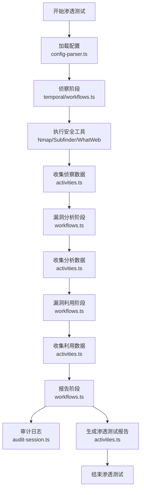
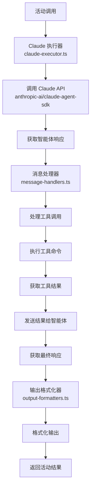
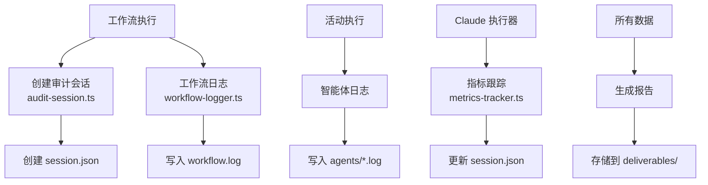
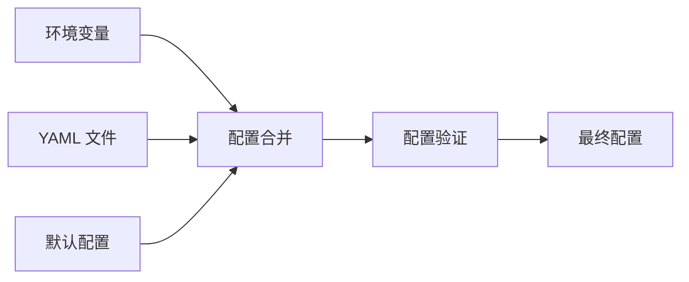
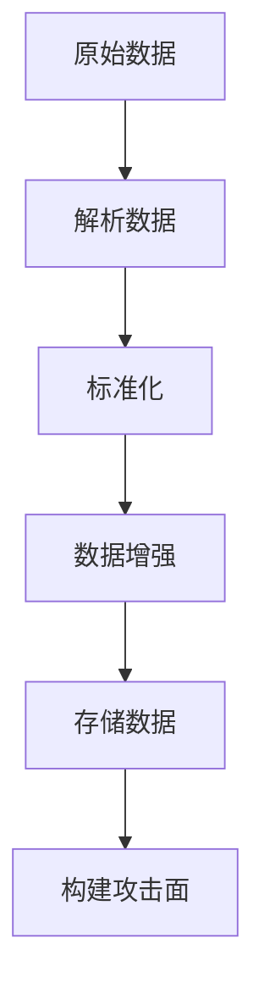
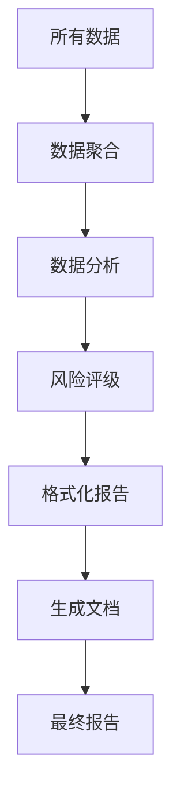
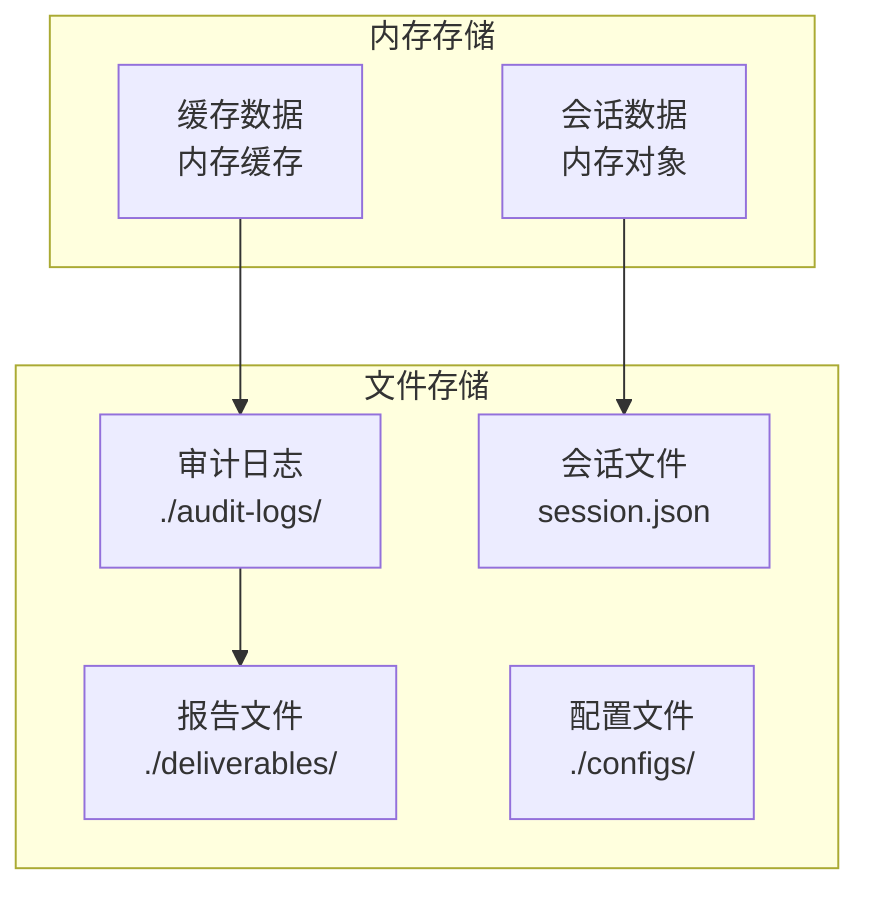
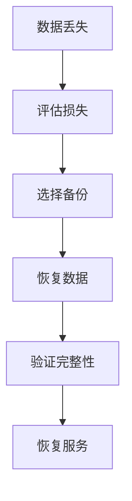

# Shannon 数据流程

## 文档信息

| 项目 | 内容 |
|------|------|
| 文档版本 | 1.0.0 |
| 创建日期 | 2026-02-12 |
| 最后更新 | 2026-02-12 |
| 文档状态 | 正式发布 |
| 作者 | 系统生成 |

---

## 目录

- [1. 数据流程概述](#1-数据流程概述)
- [2. 关键业务场景数据流程图](#2-关键业务场景数据流程图)
- [3. 数据处理逻辑](#3-数据处理逻辑)
- [4. 数据存储策略](#4-数据存储策略)
- [5. 数据持久化方案](#5-数据持久化方案)

---

## 1. 数据流程概述

### 1.1 数据流程阶段

Shannon 的数据流程分为四个主要阶段：

| 阶段 | 描述 | 输入 | 输出 |
|------|------|------|------|
| 侦察阶段 | 收集目标应用程序信息 | 目标 URL、代码仓库 | 攻击面地图 |
| 漏洞分析阶段 | 分析识别潜在漏洞 | 侦察数据 | 漏洞列表 |
| 漏洞利用阶段 | 验证漏洞真实性 | 漏洞列表 | 利用证明 |
| 报告阶段 | 生成渗透测试报告 | 所有阶段数据 | 安全报告 |

### 1.2 数据类型

| 数据类型 | 描述 | 存储位置 |
|----------|------|----------|
| 配置数据 | 用户配置和系统配置 | YAML 文件、环境变量 |
| 侦察数据 | 目标应用程序信息 | 审计日志 |
| 漏洞数据 | 识别的漏洞信息 | 审计日志 |
| 利用数据 | 漏洞利用证明 | 审计日志 |
| 报告数据 | 渗透测试报告 | Markdown 文件 |
| 审计日志 | 执行过程记录 | JSON + 文本文件 |

---

## 2. 关键业务场景数据流程图

### 2.1 完整渗透测试流程



### 2.2 智能体执行流程



### 2.3 审计数据流程



---

## 3. 数据处理逻辑

### 3.1 配置处理

#### 3.1.1 配置加载流程



#### 3.1.2 配置验证规则

| 配置项 | 类型 | 必需 | 验证规则 |
|--------|------|------|----------|
| targetUrl | string | 是 | URL 格式 |
| repo | string | 是 | 路径存在 |
| rules | array | 否 | 规则格式 |
| avoid | array | 否 | URL 格式 |
| focus | array | 否 | URL 格式 |

### 3.2 侦察数据处理

#### 3.2.1 数据收集

| 数据类型 | 收集方法 | 工具 |
|----------|----------|------|
| 端口信息 | 网络扫描 | Nmap |
| 子域名 | 被动枚举 | Subfinder |
| 技术栈 | 指纹识别 | WhatWeb |
| API 端点 | 代码分析 | Claude |

#### 3.2.2 数据处理流程



### 3.3 漏洞分析处理

#### 3.3.1 漏洞识别

| 漏洞类型 | 分析方法 | 数据来源 |
|----------|----------|----------|
| SQL 注入 | 代码分析 + 动态测试 | 源代码 + HTTP 请求 |
| XSS | 代码分析 + 动态测试 | 源代码 + HTTP 请求 |
| SSRF | 代码分析 + 动态测试 | 源代码 + HTTP 请求 |
| 认证缺陷 | 代码分析 + 动态测试 | 源代码 + HTTP 请求 |

#### 3.3.2 漏洞评估

| 评估维度 | 描述 | 评分标准 |
|----------|------|----------|
| 严重性 | 漏洞影响程度 | 高/中/低 |
| 可利用性 | 利用难度 | 容易/中等/困难 |
| 影响范围 | 受影响的范围 | 广泛/局部 |

### 3.4 漏洞利用处理

#### 3.4.1 利用验证

| 验证方法 | 描述 | 输出 |
|----------|------|------|
| 概念验证 | 构造 POC | POC 代码 |
| 数据提取 | 提取敏感数据 | 数据样本 |
| 权限提升 | 尝试提权 | 权限证明 |

#### 3.4.2 利用记录

| 记录内容 | 描述 | 格式 |
|----------|------|------|
| 利用步骤 | 详细步骤 | 文本 |
| 截图证据 | 屏幕截图 | 图片 |
| 请求数据 | HTTP 请求 | 文本 |
| 响应数据 | HTTP 响应 | 文本 |

### 3.5 报告数据处理

#### 3.5.1 报告生成流程



#### 3.5.2 报告内容

| 章节 | 内容 | 数据来源 |
|------|------|----------|
| 执行摘要 | 测试概述 | 所有阶段 |
| 漏洞详情 | 漏洞描述 | 漏洞分析 |
| 利用证明 | POC 代码 | 漏洞利用 |
| 修复建议 | 修复方案 | 最佳实践 |
| 附录 | 详细数据 | 审计日志 |

---

## 4. 数据存储策略

### 4.1 存储架构



### 4.2 存储位置

| 数据类型 | 存储位置 | 存储格式 | 说明 |
|----------|----------|----------|------|
| 审计日志 | ./audit-logs/{session}/ | JSON + 文本 | 工作流事件、智能体执行日志 |
| 会话数据 | ./audit-logs/{session}/session.json | JSON | 会话配置、执行状态、指标数据 |
| 智能体日志 | ./audit-logs/{session}/agents/ | 文本 | 智能体执行日志、消息历史 |
| 报告数据 | ./audit-logs/{session}/deliverables/ | Markdown | 渗透测试报告、漏洞详情 |
| 配置数据 | ./configs/ | YAML | 用户配置文件 |

### 4.3 数据生命周期

| 阶段 | 操作 | 说明 |
|------|------|------|
| 创建 | 创建会话目录 | 开始测试时 |
| 写入 | 写入日志和数据 | 测试过程中 |
| 更新 | 更新会话状态 | 状态变化时 |
| 归档 | 压缩旧日志 | 测试完成后 |
| 清理 | 删除过期数据 | 定期清理 |

---

## 5. 数据持久化方案

### 5.1 文件系统存储

#### 5.1.1 优势

- 简单直接，不需要额外的数据库服务
- 数据以文件形式存储，易于备份和迁移
- 可以直接查看和编辑文件
- 无需额外的数据库许可和维护成本

#### 5.1.2 劣势

- 大规模数据管理困难
- 查询效率低
- 并发写入需要额外处理
- 数据一致性需要手动保证

### 5.2 原子写入

#### 5.2.1 实现原理

```typescript
async function atomicWrite(filePath: string, content: string): Promise<void> {
  const tempPath = `${filePath}.tmp`;
  
  // 1. 写入临时文件
  await fs.writeFile(tempPath, content, 'utf-8');
  
  // 2. 验证写入成功
  const stats = await fs.stat(tempPath);
  if (stats.size === 0) {
    throw new Error('写入失败：文件大小为 0');
  }
  
  // 3. 原子重命名
  await fs.rename(tempPath, filePath);
}
```

#### 5.2.2 使用场景

- 会话数据更新
- 配置文件写入
- 报告文件生成

### 5.3 数据备份

#### 5.3.1 备份策略

| 备份类型 | 频率 | 保留时间 | 存储位置 |
|----------|------|----------|----------|
| 全量备份 | 每周 | 4 周 | 远程存储 |
| 增量备份 | 每天 | 7 天 | 本地存储 |
| 实时备份 | 实时 | 永久 | 云存储 |

#### 5.3.2 恢复流程



### 5.4 数据一致性

#### 5.4.1 一致性保证

| 机制 | 描述 | 实现方式 |
|------|------|----------|
| 互斥锁 | 保护共享资源 | Mutex |
| 原子操作 | 保证操作原子性 | 文件锁 |
| 事务处理 | 保证数据一致性 | 两阶段提交 |

#### 5.4.2 冲突处理

| 冲突类型 | 处理策略 | 说明 |
|----------|----------|------|
| 写写冲突 | 互斥锁 | 串行化写入 |
| 读写冲突 | 读写锁 | 允许并发读 |
| 版本冲突 | 乐观锁 | 检测版本号 |

---

## 附录

### A. 数据字典

| 字段名 | 类型 | 描述 | 示例 |
|--------|------|------|------|
| sessionId | string | 会话 ID | shannon-1234567890 |
| targetUrl | string | 目标 URL | https://example.com |
| repo | string | 代码仓库 | example-repo |
| status | string | 状态 | running/completed/failed |
| startTime | Date | 开始时间 | 2026-02-12T10:00:00Z |
| endTime | Date | 结束时间 | 2026-02-12T11:30:00Z |
| totalCost | number | 总成本 | 1.5 |
| totalTurns | number | 总回合数 | 100 |
| totalTime | number | 总时间（秒） | 5400 |

### B. 参考资料

1. [数据流程设计模式](https://www.enterpriseintegrationpatterns.com/)
2. [数据持久化最佳实践](https://docs.microsoft.com/en-us/azure/architecture/patterns/)
3. [文件系统设计](https://www.usenix.org/legacy/events/usenix05/tech/freenix/full_papers/braam/braam.pdf)

---

## 文档修订历史

| 版本 | 日期 | 修订内容 | 作者 |
|------|------|----------|------|
| 1.0.0 | 2026-02-12 | 初始版本 | 系统生成 |
