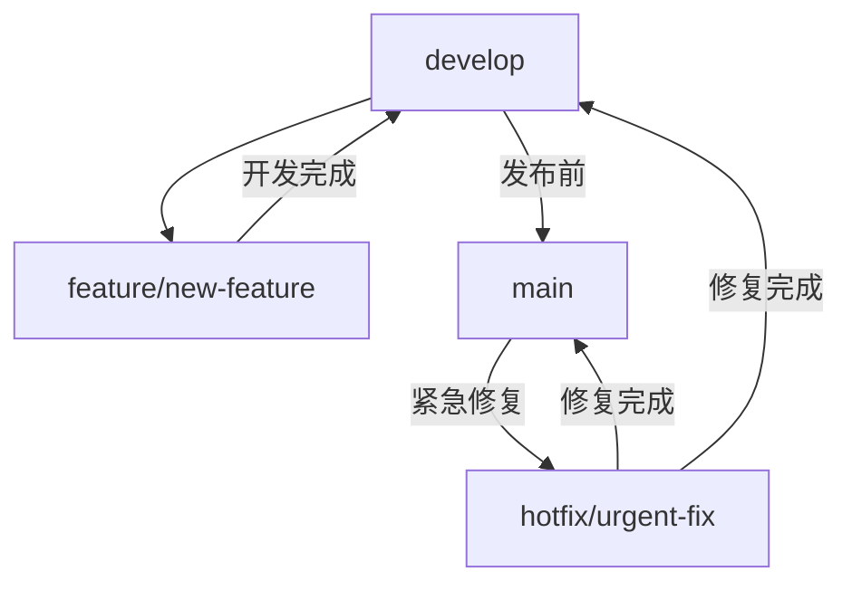
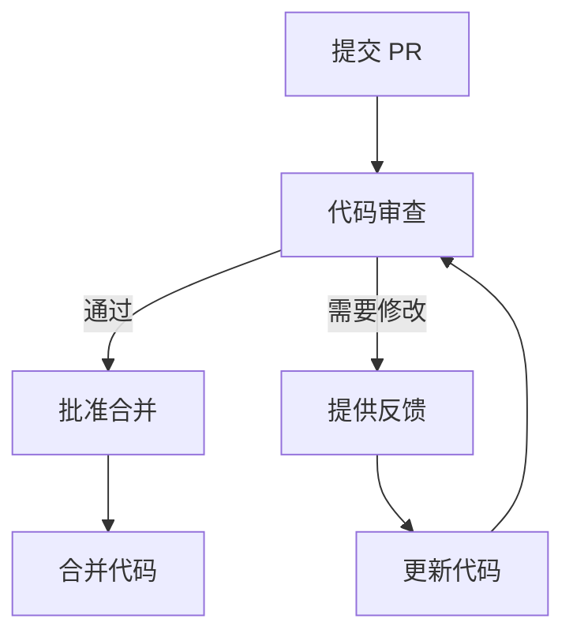

# Shannon 开发规范

## 文档信息

| 项目 | 内容 |
|------|------|
| 文档版本 | 1.0.0 |
| 创建日期 | 2026-02-12 |
| 最后更新 | 2026-02-12 |
| 文档状态 | 正式发布 |
| 作者 | 系统生成 |

---

## 目录

- [1. 编码规范](#1-编码规范)
- [2. 文档规范](#2-文档规范)
- [3. 分支管理规范](#3-分支管理规范)
- [4. 提交信息规范](#4-提交信息规范)
- [5. 代码审查标准](#5-代码审查标准)

---

## 1. 编码规范

### 1.1 命名规范

#### 1.1.1 文件命名

| 项目 | 规范 | 示例 |
|------|------|------|
| 文件命名 | 使用 kebab-case | `queue-validation.ts` |
| 目录命名 | 使用 kebab-case | `src/ai` |
| 组件文件 | 与组件名对应 | `claude-executor.ts` |

#### 1.1.2 变量命名

| 项目 | 规范 | 示例 |
|------|------|------|
| 变量命名 | 使用 camelCase | `const targetUrl = "https://example.com";` |
| 函数命名 | 使用 camelCase | `async function executeAgent() {}` |
| 类命名 | 使用 PascalCase | `class PentestError extends Error {}` |
| 常量命名 | 使用 UPPER_SNAKE_CASE | `const MAX_RETRY_ATTEMPTS = 3;` |
| 类型命名 | 使用 PascalCase | `interface AgentContext {}` |

### 1.2 代码风格

#### 1.2.1 缩进和空格

| 项目 | 规范 |
|------|------|
| 缩进 | 使用 2 个空格缩进 |
| 制表符 | 不使用制表符 |
| 行尾空格 | 移除行尾空格 |

#### 1.2.2 括号和分号

| 项目 | 规范 |
|------|------|
| 大括号 | 使用大括号包裹所有代码块 |
| 左大括号位置 | 与语句在同一行 |
| 分号 | 使用分号结束语句 |

#### 1.2.3 引号和字符串

| 项目 | 规范 |
|------|------|
| 字符串 | 使用单引号 |
| 模板字符串 | 使用反引号 |
| 行长度 | 每行不超过 80 个字符 |

#### 1.2.4 导入语句

| 项目 | 规范 |
|------|------|
| 导入语法 | 使用 ES 模块导入语法 |
| 导入顺序 | 按字母顺序排列 |
| 类型导入 | 使用 `import type` |

### 1.3 注释要求

#### 1.3.1 函数注释

使用 JSDoc 风格注释：

```typescript
/**
 * 执行智能体任务
 * @param prompt - 提示内容
 * @param context - 上下文信息
 * @param tools - 可用工具列表
 * @returns 智能体响应
 * @throws PentestError 当执行失败时抛出
 */
async function executeAgent(
  prompt: string,
  context: AgentContext,
  tools?: string[]
): Promise<AgentResponse> {
  // 实现...
}
```

#### 1.3.2 类型注释

为所有类型添加描述：

```typescript
/**
 * 智能体上下文信息
 */
interface AgentContext {
  /** 目标 URL */
  url: string;
  /** 代码仓库路径 */
  repo: string;
  /** 当前阶段 */
  stage: 'reconnaissance' | 'vulnerability-analysis' | 'exploitation' | 'reporting';
}
```

#### 1.3.3 代码注释

为复杂逻辑添加注释：

```typescript
// 检查是否为可重试错误
if (error instanceof PentestError && error.retryable) {
  // 等待一段时间后重试
  await sleep(RETRY_DELAY);
  return await retryExecution();
}
```

---

## 2. 文档规范

### 2.1 文档类型

| 文档类型 | 描述 | 位置 |
|----------|------|------|
| README.md | 项目概述 | 项目根目录 |
| API 文档 | 接口定义 | 工程文档/ |
| 架构文档 | 架构设计 | 工程文档/ |
| 部署文档 | 部署指南 | 工程文档/ |

### 2.2 文档格式

#### 2.2.1 Markdown 格式

- 使用标准 Markdown 语法
- 标题层级不超过 4 级
- 使用代码块展示代码
- 使用表格展示结构化数据

#### 2.2.2 文档结构

```markdown
# 文档标题

## 文档信息

| 项目 | 内容 |
|------|------|
| 文档版本 | 1.0.0 |
| 创建日期 | 2026-02-12 |

## 目录

- [章节 1](#章节-1)
- [章节 2](#章节-2)

## 1. 章节 1

内容...

## 文档修订历史

| 版本 | 日期 | 修订内容 | 作者 |
|------|------|----------|------|
| 1.0.0 | 2026-02-12 | 初始版本 | 系统生成 |
```

---

## 3. 分支管理规范

### 3.1 分支命名

| 分支类型 | 命名规范 | 示例 |
|----------|----------|------|
| 主分支 | main | main |
| 开发分支 | develop | develop |
| 功能分支 | feature/{feature-name} | feature/add-openai-support |
| 修复分支 | bugfix/{bug-name} | bugfix/fix-auth-error |
| 热修复分支 | hotfix/{fix-name} | hotfix/security-patch |

### 3.2 分支策略



### 3.3 分支保护规则

| 分支 | 保护规则 |
|------|----------|
| main | 禁止直接推送，需要 PR 审查 |
| develop | 禁止直接推送，需要 PR 审查 |

---

## 4. 提交信息规范

### 4.1 提交信息格式

```
<type>(<scope>): <subject>

<body>

<footer>
```

### 4.2 提交类型

| 类型 | 描述 | 示例 |
|------|------|------|
| feat | 新功能 | feat(ai): add OpenAI support |
| fix | 修复 bug | fix(temporal): fix workflow timeout |
| docs | 文档更新 | docs(readme): update installation guide |
| style | 代码风格修改 | style(cli): format code |
| refactor | 代码重构 | refactor(audit): extract common logic |
| test | 测试更新 | test(ai): add unit tests |
| chore | 构建/依赖更新 | chore(deps): update dependencies |

### 4.3 提交范围

| 范围 | 描述 |
|------|------|
| cli | 命令行界面 |
| ai | 智能体模块 |
| temporal | 工作流模块 |
| audit | 审计模块 |
| config | 配置模块 |
| deps | 依赖管理 |

### 4.4 提交示例

```
feat(ai): add OpenAI model support

Add support for OpenAI GPT models through OpenRouter.
This allows users to choose between Claude and OpenAI models.

Closes #123
```

---

## 5. 代码审查标准

### 5.1 审查清单

#### 5.1.1 错误处理

- [ ] 所有错误使用 PentestError
- [ ] 错误类型选择正确
- [ ] 可重试标志设置合理
- [ ] 上下文包含足够的调试信息
- [ ] 没有静默吞噬错误

#### 5.1.2 并发安全

- [ ] 并行操作使用互斥锁保护
- [ ] 修改前重新加载数据
- [ ] 使用原子写入操作
- [ ] 信号量在 finally 块中释放

#### 5.1.3 安全规范

- [ ] 没有硬编码的敏感信息
- [ ] 输入验证充分
- [ ] 安全工具使用正确
- [ ] 没有潜在的注入漏洞

#### 5.1.4 代码质量

- [ ] 没有死代码
- [ ] 没有重复代码
- [ ] 代码逻辑清晰
- [ ] 注释充分且有意义

#### 5.1.5 性能优化

- [ ] 避免不必要的计算
- [ ] 合理使用缓存
- [ ] 避免阻塞操作
- [ ] 内存使用合理

### 5.2 审查流程



### 5.3 审查标准

| 等级 | 描述 | 处理方式 |
|------|------|----------|
| 必须修改 | 影响功能或安全 | 必须修改后才能合并 |
| 建议修改 | 改进代码质量 | 建议修改，但不强制 |
| 可选修改 | 风格或优化 | 可选修改 |

---

## 附录

### A. 代码风格配置

```json
{
  "editor.tabSize": 2,
  "editor.insertSpaces": true,
  "editor.formatOnSave": true,
  "editor.codeActionsOnSave": {
    "source.fixAll": true
  }
}
```

### B. 参考资料

1. [TypeScript 编码规范](https://www.typescriptlang.org/docs/handbook/declaration-files/do-s-and-don-ts.html)
2. [JavaScript Standard Style](https://standardjs.com/)
3. [Git 提交信息规范](https://www.conventionalcommits.org/)

---

## 文档修订历史

| 版本 | 日期 | 修订内容 | 作者 |
|------|------|----------|------|
| 1.0.0 | 2026-02-12 | 初始版本 | 系统生成 |
