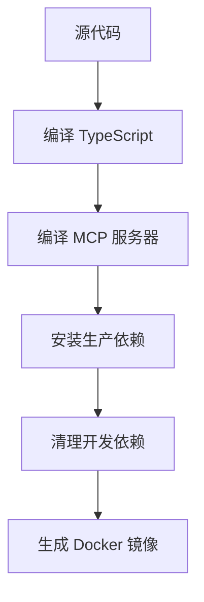
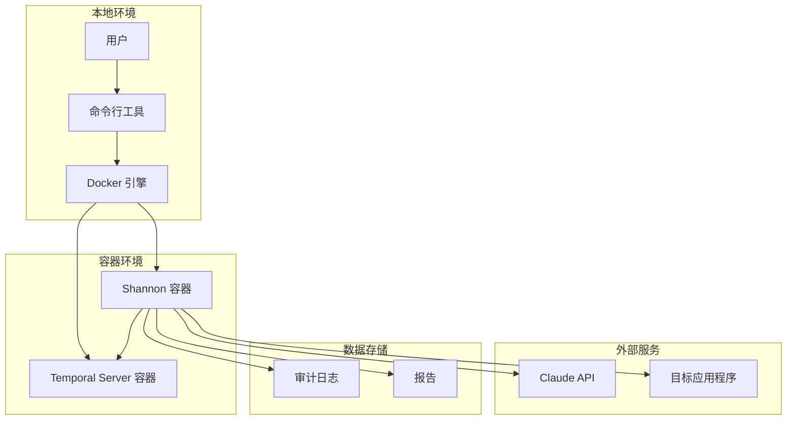

# Shannon 构建部署流程

## 文档信息

| 项目 | 内容 |
|------|------|
| 文档版本 | 1.0.0 |
| 创建日期 | 2026-02-12 |
| 最后更新 | 2026-02-12 |
| 文档状态 | 正式发布 |
| 作者 | purpose168 |

---

## 目录

- [1. 项目构建流程](#1-项目构建流程)
- [2. 环境配置](#2-环境配置)
- [3. 自动化部署流程](#3-自动化部署流程)
- [4. 部署注意事项](#4-部署注意事项)

---

## 1. 项目构建流程

### 1.1 依赖管理

#### 1.1.1 Node.js 依赖

使用 `package.json` 管理依赖：

```json
{
  "dependencies": {
    "@anthropic-ai/claude-agent-sdk": "^0.2.38",
    "@temporalio/activity": "^1.11.0",
    "@temporalio/client": "^1.11.0"
  },
  "devDependencies": {
    "@types/node": "^25.0.3",
    "typescript": "^5.9.3"
  }
}
```

**安装命令**：

```bash
# 安装依赖
npm install

# 清洁安装（推荐用于 CI/CD）
npm ci
```

#### 1.1.2 系统依赖

使用 Docker 多阶段构建安装系统依赖：

- 安全工具：Nmap、Subfinder、WhatWeb、Schemathesis
- 语言运行时：Node.js、Python、Ruby
- 浏览器：Chromium

### 1.2 编译配置

#### 1.2.1 TypeScript 编译

**配置文件**：`tsconfig.json`

```json
{
  "compilerOptions": {
    "target": "ES2022",
    "module": "ES2022",
    "moduleResolution": "node",
    "strict": true,
    "esModuleInterop": true,
    "skipLibCheck": true,
    "forceConsistentCasingInFileNames": true,
    "outDir": "./dist",
    "rootDir": "./src"
  }
}
```

**编译命令**：

```bash
npm run build
```

#### 1.2.2 构建步骤



### 1.3 打包策略

#### 1.3.1 Docker 镜像构建

**多阶段构建**：

```dockerfile
# 第一阶段：构建环境
FROM node:22-alpine AS builder
WORKDIR /app
COPY package*.json ./
RUN npm ci
COPY . .
RUN npm run build

# 第二阶段：运行环境
FROM chainguard/wolfi-base:latest
WORKDIR /app
COPY --from=builder /app/dist ./dist
COPY --from=builder /app/node_modules ./node_modules
```

#### 1.3.2 镜像优化

| 优化措施 | 描述 |
|----------|------|
| 多阶段构建 | 减少最终镜像大小 |
| 最小化基础镜像 | 使用 Chainguard Wolfi |
| 移除开发依赖 | 减少攻击面 |
| 层缓存优化 | 加速构建过程 |

---

## 2. 环境配置

### 2.1 开发环境

#### 2.1.1 环境要求

| 组件 | 版本要求 |
|------|----------|
| Node.js | 22.x |
| npm | 9.x+ |
| TypeScript | 5.9.3 |
| Git | 2.x+ |

#### 2.1.2 配置步骤

```bash
# 1. 克隆代码仓库
git clone https://github.com/KeygraphHQ/shannon.git
cd shannon

# 2. 安装依赖
npm install

# 3. 编译代码
npm run build

# 4. 配置凭证
export ANTHROPIC_API_KEY="your-api-key"

# 5. 运行
node dist/shannon.js start URL=https://example.com REPO=example-repo
```

### 2.2 测试环境

#### 2.2.1 环境要求

| 组件 | 版本要求 |
|------|----------|
| Docker | 20.10.0+ |
| Docker Compose | 2.x+ |

#### 2.2.2 配置步骤

```bash
# 1. 构建 Docker 镜像
docker build -t shannon .

# 2. 运行容器
docker-compose up

# 3. 配置环境变量
export ANTHROPIC_API_KEY="your-api-key"

# 4. 运行测试
./shannon start URL=https://test-app.com REPO=test-repo
```

### 2.3 生产环境

#### 2.3.1 环境要求

| 组件 | 版本要求 |
|------|----------|
| Docker | 20.10.0+ |
| Docker Compose | 2.x+ |
| 内存 | 8 GB+ |
| CPU | 4 核+ |

#### 2.3.2 配置步骤

```bash
# 1. 使用正式镜像
docker pull keygraph/shannon:latest

# 2. 配置环境变量
cat > .env << 'EOF'
ANTHROPIC_API_KEY=your-api-key
EOF

# 3. 运行容器
docker-compose up -d

# 4. 监控运行状态
docker-compose logs -f
```

---

## 3. 自动化部署流程

### 3.1 部署架构图



### 3.2 部署步骤

#### 3.2.1 准备阶段

```bash
# 1. 克隆代码仓库
git clone https://github.com/KeygraphHQ/shannon.git
cd shannon

# 2. 配置凭证
export ANTHROPIC_API_KEY="your-api-key"

# 或创建 .env 文件
cat > .env << 'EOF'
ANTHROPIC_API_KEY=your-api-key
EOF
```

#### 3.2.2 构建阶段

```bash
# 1. 构建 Docker 镜像
docker build -t shannon .

# 或使用 docker-compose
docker-compose build
```

#### 3.2.3 启动阶段

```bash
# 1. 运行渗透测试
./shannon start URL=https://your-app.com REPO=your-repo

# 2. 查看工作流 ID
# 输出：Workflow ID: shannon-1234567890
```

#### 3.2.4 监控阶段

```bash
# 1. 查看实时日志
./shannon logs

# 2. 查询工作流进度
./shannon query ID=shannon-1234567890

# 3. 访问 Temporal UI
# http://localhost:8233/
```

#### 3.2.5 停止阶段

```bash
# 1. 停止所有容器
./shannon stop

# 2. 清理数据（可选）
./shannon stop CLEAN=true
```

---

## 4. 部署注意事项

### 4.1 安全注意事项

| 注意事项 | 描述 |
|----------|------|
| 不要在生产环境运行 | Shannon 是渗透测试工具，仅用于授权测试 |
| 仅测试授权目标 | 确保有合法授权 |
| 保护 API 密钥 | 不要将密钥提交到版本控制 |

### 4.2 性能注意事项

| 注意事项 | 描述 |
|----------|------|
| 测试时间长 | 渗透测试可能需要 1-1.5 小时 |
| 资源需求 | 确保有足够的内存和 CPU |
| 网络稳定 | 确保网络连接稳定 |

### 4.3 存储注意事项

| 注意事项 | 描述 |
|----------|------|
| 日志空间 | 审计日志可能占用大量空间 |
| 定期清理 | 定期清理旧的审计日志 |
| 备份报告 | 备份重要的测试报告 |

### 4.4 故障处理

| 问题 | 解决方案 |
|------|----------|
| 工作流失败 | 查看 Temporal UI 中的错误信息 |
| 智能体挂起 | 检查审计日志中的详细错误 |
| 网络问题 | 检查网络连接和防火墙设置 |

---

## 附录

### A. Docker Compose 配置

```yaml
version: '3.8'

services:
  temporal:
    image: temporalio/auto-setup:latest
    ports:
      - "7233:7233"
      - "8233:8233"
    environment:
      - DB=postgresql
    volumes:
      - temporal-data:/var/lib/temporal

  shannon:
    build: .
    depends_on:
      - temporal
    environment:
      - ANTHROPIC_API_KEY=${ANTHROPIC_API_KEY}
    volumes:
      - ./audit-logs:/app/audit-logs
      - ./deliverables:/app/deliverables

volumes:
  temporal-data:
```

### B. 参考资料

1. [Docker 官方文档](https://docs.docker.com/)
2. [Temporal.io 部署指南](https://docs.temporal.io/cluster-deployment)
3. [Node.js 部署最佳实践](https://nodejs.org/en/docs/guides/)

---

## 文档修订历史

| 版本 | 日期 | 修订内容 | 作者 |
|------|------|----------|------|
| 1.0.0 | 2026-02-12 | 初始版本 | purpose168 |
