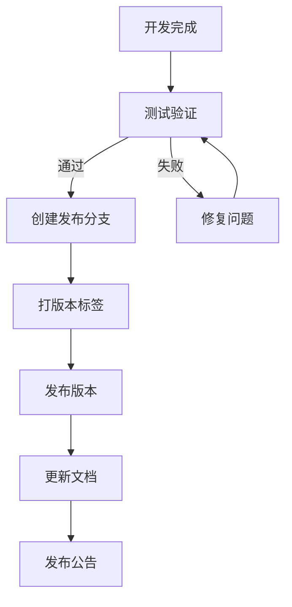
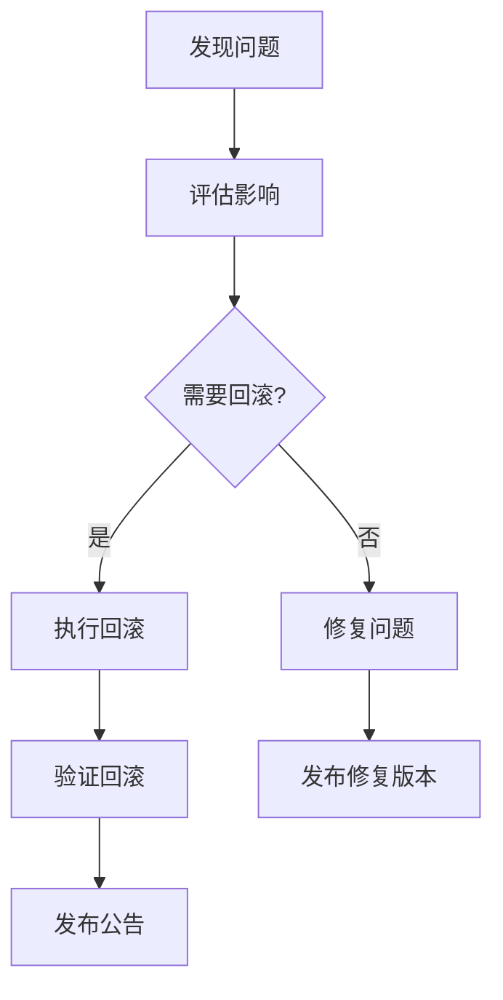

# Shannon 版本控制策略

## 文档信息

| 项目 | 内容 |
|------|------|
| 文档版本 | 1.0.0 |
| 创建日期 | 2026-02-12 |
| 最后更新 | 2026-02-12 |
| 文档状态 | 正式发布 |
| 作者 | purpose168 |

---

## 目录

- [1. 版本号命名规则](#1-版本号命名规则)
- [2. 发布周期](#2-发布周期)
- [3. 变更管理流程](#3-变更管理流程)
- [4. 版本回滚机制](#4-版本回滚机制)
- [5. 版本兼容性保障](#5-版本兼容性保障)

---

## 1. 版本号命名规则

### 1.1 语义化版本控制

Shannon 项目使用语义化版本控制（Semantic Versioning），版本号格式为：`MAJOR.MINOR.PATCH`

| 版本部分 | 描述 | 更新时机 |
|----------|------|----------|
| MAJOR | 主版本号 | 不兼容的 API 变更 |
| MINOR | 次版本号 | 向后兼容的新功能 |
| PATCH | 补丁版本号 | 向后兼容的错误修复 |

### 1.2 版本示例

| 版本号 | 描述 |
|--------|------|
| 1.0.0 | 首个正式版本 |
| 1.1.0 | 添加新功能，向后兼容 |
| 1.1.1 | 修复 bug，向后兼容 |
| 2.0.0 | 重大变更，不兼容旧版本 |

### 1.3 预发布版本

| 标识 | 描述 | 示例 |
|------|------|------|
| alpha | 内部测试版本 | 1.0.0-alpha.1 |
| beta | 公开测试版本 | 1.0.0-beta.1 |
| rc | 发布候选版本 | 1.0.0-rc.1 |

---

## 2. 发布周期

### 2.1 发布类型

| 发布类型 | 频率 | 内容 |
|----------|------|------|
| 主版本发布 | 按需 | 重大功能或架构变更 |
| 次版本发布 | 每月 | 新功能和改进 |
| 补丁发布 | 按需 | Bug 修复和安全补丁 |

### 2.2 发布流程

### 2.3 发布检查清单

- [ ] 所有测试通过
- [ ] 文档已更新
- [ ] 变更日志已更新
- [ ] 版本号已更新
- [ ] 发布说明已准备

---

## 3. 变更管理流程

### 3.1 变更请求

| 步骤 | 描述 |
|------|------|
| 1. 提交 Issue | 通过 GitHub Issues 提交变更请求 |
| 2. 评估影响 | 评估变更的影响范围 |
| 3. 分配优先级 | 根据影响和紧急程度分配优先级 |
| 4. 分配责任人 | 分配给合适的开发者 |

### 3.2 变更实施

| 步骤 | 描述 |
|------|------|
| 1. 创建分支 | 从 develop 创建功能分支 |
| 2. 实施变更 | 按照规范实施变更 |
| 3. 编写测试 | 编写或更新测试 |
| 4. 更新文档 | 更新相关文档 |

### 3.3 变更审查

| 步骤 | 描述 |
|------|------|
| 1. 提交 PR | 提交 Pull Request |
| 2. 代码审查 | 进行代码审查 |
| 3. 测试验证 | 运行自动化测试 |
| 4. 批准合并 | 审查通过后合并 |

---

## 4. 版本回滚机制

### 4.1 回滚触发条件

| 条件 | 描述 |
|------|------|
| 严重功能缺陷 | 影响核心功能的问题 |
| 安全漏洞 | 发现安全漏洞 |
| 性能问题 | 严重的性能问题 |
| 用户反馈 | 大量用户反馈问题 |

### 4.2 回滚流程

### 4.3 回滚步骤

| 步骤 | 命令 | 描述 |
|------|------|------|
| 1. 识别版本 | `git tag -l` | 列出所有版本 |
| 2. 切换版本 | `git checkout v1.0.0` | 切换到目标版本 |
| 3. 构建部署 | `docker build -t shannon:v1.0.0 .` | 构建并部署 |
| 4. 验证结果 | - | 验证回滚成功 |

---

## 5. 版本兼容性保障

### 5.1 API 兼容性

| 兼容类型 | 描述 | 保障措施 |
|----------|------|----------|
| CLI 接口 | 命令行接口 | 保持参数兼容 |
| 配置格式 | 配置文件格式 | 支持旧格式 |
| 输出格式 | 报告和日志格式 | 保持格式兼容 |

### 5.2 数据兼容性

| 数据类型 | 兼容策略 |
|----------|----------|
| 审计日志 | 保持格式兼容 |
| 报告格式 | 保持格式兼容 |
| 会话数据 | 提供迁移工具 |

### 5.3 依赖兼容性

| 依赖类型 | 兼容策略 |
|----------|----------|
| Node.js | 锁定版本范围 |
| Docker | 支持多个版本 |
| 外部工具 | 版本检查 |

---

## 附录

### A. 版本历史

| 版本 | 日期 | 主要变更 |
|------|------|----------|
| 1.0.0 | 2026-02-12 | 初始版本 |

### B. 参考资料

1. [语义化版本控制](https://semver.org/)
2. [Git 版本控制](https://git-scm.com/book/en/v2)
3. [GitHub Flow](https://docs.github.com/en/get-started/quickstart/github-flow)

---

## 文档修订历史

| 版本 | 日期 | 修订内容 | 作者 |
|------|------|----------|------|
| 1.0.0 | 2026-02-12 | 初始版本 | purpose168 |
