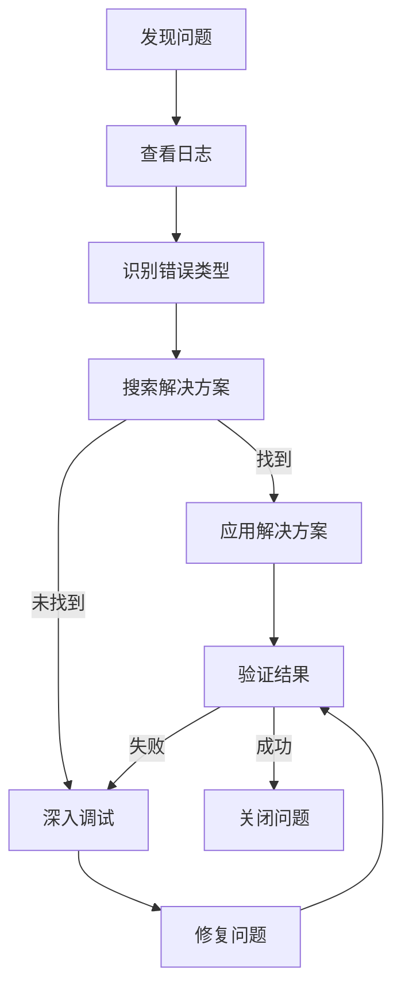

# Shannon 常见问题解决方案

## 文档信息

| 项目 | 内容 |
|------|------|
| 文档版本 | 1.0.0 |
| 创建日期 | 2026-02-12 |
| 最后更新 | 2026-02-12 |
| 文档状态 | 正式发布 |
| 作者 | 系统生成 |

---

## 目录

- [1. 问题排查指南](#1-问题排查指南)
- [2. 常见错误](#2-常见错误)
- [3. 性能瓶颈](#3-性能瓶颈)
- [4. 安全漏洞](#4-安全漏洞)
- [5. 最佳实践](#5-最佳实践)

---

## 1. 问题排查指南

### 1.1 排查流程



### 1.2 日志查看

| 日志类型 | 位置 | 查看命令 |
|----------|------|----------|
| 工作流日志 | ./audit-logs/{session}/workflow.log | `cat workflow.log` |
| 智能体日志 | ./audit-logs/{session}/agents/ | `cat agents/*.log` |
| Temporal 日志 | Temporal UI | http://localhost:8233/ |

### 1.3 错误类型识别

| 错误类型 | 描述 | 可重试 |
|----------|------|--------|
| config | 配置文件问题 | 否 |
| network | 连接/超时问题 | 是 |
| tool | 外部工具失败 | 是 |
| prompt | Claude SDK/API 问题 | 有时 |
| filesystem | 文件读/写错误 | 有时 |
| validation | 交付物验证失败 | 是 |
| billing | API 配额/计费限制 | 否 |
| unknown | 意外错误 | 取决于 |

---

## 2. 常见错误

### 2.1 智能体执行问题

#### 2.1.1 智能体挂起

**症状**：智能体无限挂起，无响应

**可能原因**：
- MCP 服务器崩溃
- Playwright 超时
- 网络连接问题

**诊断方法**：
```bash
# 检查 Playwright 日志
ls -la /tmp/playwright-*

# 检查智能体日志
cat audit-logs/{session}/agents/*.log | grep -i "error\|timeout"
```

**解决方案**：
- 重启 MCP 服务器
- 检查网络连接
- 增加超时时间

**预防措施**：
- 确保网络连接稳定
- 监控 MCP 服务器状态
- 使用合理的超时设置

#### 2.1.2 验证失败

**症状**："验证失败：缺少交付物"

**可能原因**：
- 智能体未创建预期文件
- 文件路径错误
- 权限问题

**诊断方法**：
```bash
# 检查交付物目录
ls -la deliverables/

# 检查文件权限
ls -la audit-logs/{session}/deliverables/
```

**解决方案**：
- 检查交付物目录
- 审查智能体提示
- 修复权限问题

### 2.2 工作流执行问题

#### 2.2.1 Git 检查点失败

**症状**：Git 检查点创建失败

**可能原因**：
- 未提交的更改
- git 锁文件存在
- 权限问题

**诊断方法**：
```bash
# 检查未提交的更改
git status

# 检查 git 锁
ls -la .git/*.lock
```

**解决方案**：
```bash
# 提交或暂存更改
git add .
git commit -m "保存更改"

# 移除 git 锁
rm .git/index.lock
```

#### 2.2.2 会话限制

**症状**："会话限制已达到"

**可能原因**：
- Claude API 计费限制
- 配额用尽

**诊断方法**：
- 检查 API 使用情况
- 查看账单信息

**解决方案**：
- 检查 API 使用情况
- 考虑升级计划
- 等待配额重置

**注意**：此类错误不可重试

### 2.3 配置问题

#### 2.3.1 配置解析错误

**症状**：配置文件解析失败

**可能原因**：
- YAML 格式错误
- 缺少必需字段
- 字段类型错误

**诊断方法**：
```bash
# 使用 YAML 验证工具
yamllint config.yaml

# 检查配置文件
cat config.yaml
```

**解决方案**：
- 修复 YAML 格式
- 添加缺少的字段
- 更正字段类型

#### 2.3.2 环境变量缺失

**症状**：API 密钥未设置

**可能原因**：
- 环境变量未设置
- .env 文件不存在

**诊断方法**：
```bash
# 检查环境变量
echo $ANTHROPIC_API_KEY

# 检查 .env 文件
cat .env
```

**解决方案**：
```bash
# 设置环境变量
export ANTHROPIC_API_KEY="your-api-key"

# 或创建 .env 文件
cat > .env << 'EOF'
ANTHROPIC_API_KEY=your-api-key
EOF
```

---

## 3. 性能瓶颈

### 3.1 智能体响应慢

**症状**：智能体响应时间长

**可能原因**：
- API 调用频繁
- 提示内容过大
- 网络延迟

**优化策略**：
- 减少 API 调用次数
- 优化提示内容
- 使用流式响应

### 3.2 工作流执行慢

**症状**：工作流执行时间长

**可能原因**：
- 活动协调开销大
- 资源使用过高
- 并行度不足

**优化策略**：
- 增加并行执行
- 优化活动执行顺序
- 合理设置超时时间

### 3.3 系统资源占用高

**症状**：内存或 CPU 使用过高

**可能原因**：
- 内存泄漏
- CPU 密集型操作
- 资源限制不足

**优化策略**：
- 减少内存使用
- 优化 CPU 密集型操作
- 增加资源限制

---

## 4. 安全漏洞

### 4.1 常见安全问题

#### 4.1.1 硬编码敏感信息

**问题**：代码中包含 API 密钥或密码

**解决方案**：
- 使用环境变量
- 使用配置文件
- 使用密钥管理服务

#### 4.1.2 不安全的输入处理

**问题**：未验证用户输入

**解决方案**：
- 实现输入验证
- 使用参数化查询
- 转义特殊字符

### 4.2 安全测试最佳实践

| 实践 | 描述 |
|------|------|
| 定期安全测试 | 定期进行安全测试 |
| 多种测试工具 | 使用多种安全测试工具 |
| 模拟真实攻击 | 模拟真实攻击场景 |
| 代码审查 | 定期进行安全代码审查 |

---

## 5. 最佳实践

### 5.1 代码质量

| 实践 | 描述 |
|------|------|
| 遵循编码规范 | 遵循项目编码规范 |
| 编写清晰代码 | 编写清晰、简洁的代码 |
| 实现错误处理 | 实现全面的错误处理 |
| 定期代码审查 | 定期进行代码审查 |

### 5.2 性能优化

| 实践 | 描述 |
|------|------|
| 监控系统性能 | 监控系统性能指标 |
| 识别瓶颈 | 识别并优化瓶颈 |
| 合理使用资源 | 合理使用系统资源 |
| 实现缓存 | 实现缓存和批处理 |

### 5.3 安全性

| 实践 | 描述 |
|------|------|
| 遵循安全最佳实践 | 遵循安全最佳实践 |
| 定期安全测试 | 定期进行安全测试 |
| 保持依赖更新 | 保持依赖更新 |
| 安全配置管理 | 实现安全的配置管理 |

---

## 附录

### A. 故障排除指南

| 问题 | 可能原因 | 解决方案 |
|------|----------|----------|
| 智能体挂起 | MCP 服务器崩溃 | 检查 Playwright 日志：`/tmp/playwright-*` |
| 验证失败 | 智能体未创建预期文件 | 检查 `deliverables/` 目录，审查提示 |
| Git 检查点失败 | 未提交的更改、git 锁 | 运行 `git status`，移除 `.git/index.lock` |
| 会话限制 | Claude API 计费限制 | 检查 API 使用情况，考虑升级计划 |
| 并行智能体失败 | 共享资源争用 | 检查互斥锁使用，错开启动时间 |
| 成本未跟踪 | 指标未重新加载 | 在更新前添加 `metricsTracker.reload()` |
| session.json 损坏 | 崩溃期间的部分写入 | 删除并重启，或从备份恢复 |
| YAML 配置被拒绝 | 无效的模式 | 手动通过 AJV 验证器运行 |
| 提示变量未替换 | 缺少占位符 | 检查 `prompt-manager.ts` 插值 |

### B. 参考资料

1. [Temporal.io 故障排除](https://docs.temporal.io/troubleshooting)
2. [Anthropic API 错误代码](https://docs.anthropic.com/claude/reference/errors)
3. [Docker 故障排除](https://docs.docker.com/engine/troubleshooting/)

---

## 文档修订历史

| 版本 | 日期 | 修订内容 | 作者 |
|------|------|----------|------|
| 1.0.0 | 2026-02-12 | 初始版本 | 系统生成 |
